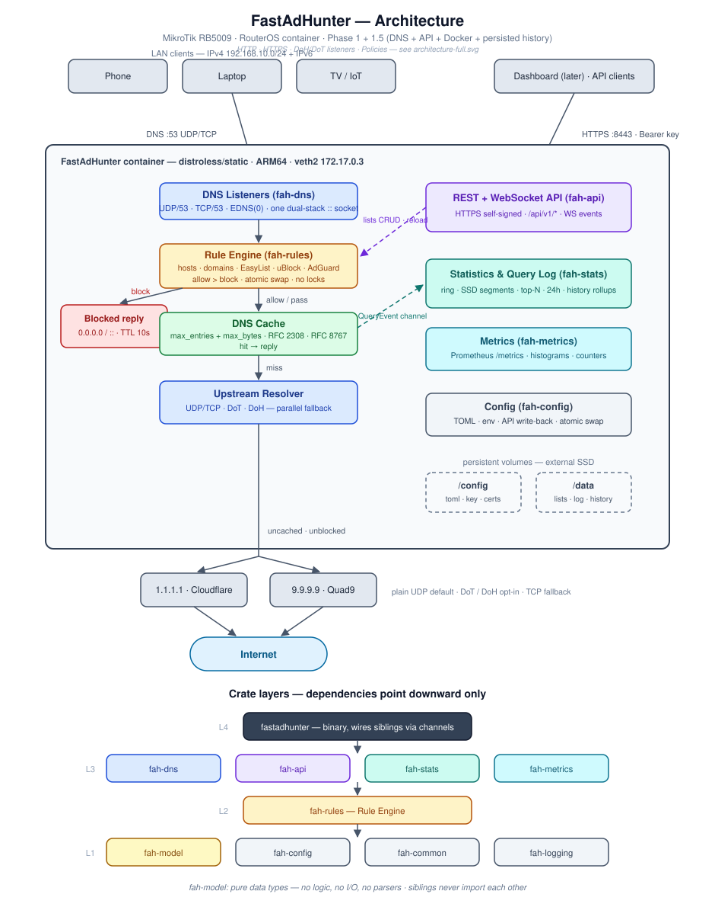

# ARCHITECTURE

How FastAdHunter is put together. Terms are defined in [CONTEXT.md](CONTEXT.md);
decisions with real trade-offs are recorded in [docs/decisions/](docs/decisions/).

---

## System Overview



Full-page version: [docs/diagrams/architecture.html](docs/diagrams/architecture.html)

```text
             Dashboard (optional, later phase)
                     │
          REST / WebSocket API  (fah-api)
                     │
             FastAdHunter Core
                     │
 ┌─────────────────────────────────────┐
 │ DNS Engine        (fah-dns)         │
 │ HTTP Engine       (fah-http)        │
 │ HTTPS Engine      (Phase 3)         │
 │ Rule Engine       (fah-rules)       │
 │ Statistics        (fah-stats)       │
 │ Metrics           (fah-metrics)     │
 └─────────────────────────────────────┘
                     │
                 Internet
```

The dashboard is a separate deliverable and communicates exclusively through
the API. The core never depends on any UI.

---

## DNS Pipeline

Order matters: the Rule Engine runs **before** the cache, so rule changes take
effect instantly and the cache never stores verdicts
(see [ADR-0001](docs/decisions/0001-rules-before-cache.md)).

```text
Receive Query (UDP/53, TCP/53)
      │
Rule Engine ── verdict
      │
      ├─ Block  → synthesize 0.0.0.0 / :: (TTL 10s) ──► Reply
      │
Cache Lookup ── hit ────────────────────────────────► Reply
      │ miss
Upstream Resolver (UDP/TCP → DoT/DoH per config)
      │
Cache Store
      │
Reply
```

Pipeline properties:

- **Verdict first.** Every query gets a fresh verdict; unblocking/blocking a
  domain needs no cache flush.
- **Cache stores upstream answers only.** Bounded size (configurable),
  TTL-respecting with clamps, RFC 2308 negative caching, RFC 8767 serve-stale
  when upstreams are unreachable.
- **Blocked queries never touch the network.**

## Listeners

Every engine binds through `fah_common::listen`, which lives at L1 precisely
because the engines are L3 siblings that cannot import each other and must not
disagree: `IPV6_V6ONLY` is cleared explicitly, so `::` serves both stacks by
decision rather than by inheriting the host's `net.ipv6.bindv6only`. Binding
and serving are separate calls throughout — bind may need privilege, serving
must not have it (ADR-0004).

### DNS (Phase 1)

- UDP/53 with EDNS(0); TCP/53 for truncation fallback (mandatory). TCP is
  bounded by `[dns] tcp_max_connections` (permit before accept) and a 16 KiB
  per-message length bound; UDP by the optional `[dns] udp_max_inflight`
  admission ceiling (admission before the datagram is copied, a full ceiling
  drops the datagram unanswered; `0` = no cap). All surface on
  `/api/v1/telemetry`.
- DoT/DoH **listeners** arrive in a later phase (client cert distribution
  depends on Phase 3 certificate machinery).
- DNSSEC: pass-through (DO bit and RRSIGs forwarded untouched). Local
  validation is a roadmap item, off by default when it lands.

### HTTP (Phase 2)

- TCP on `[http.listen]`, default **8080** — not 80. The container runs
  unprivileged after ADR-0004's drop and the router dst-nats 80 here, so HTTP
  never needs the privileged port that forced ADR-0004 on DNS.
- Bound **only** when `engine.mode` includes `http`. In `dns` mode the port is
  not bound at all: binding and then not serving would hold the port against
  anything else on the host and still complete a `connect()`, which a client
  cannot tell from a hung proxy.

## Upstreams

- Protocols: plain UDP/53 with TCP fallback, DoT, DoH (Hickory + rustls).
- Strategy: ordered parallel fallback — primary first, next on timeout/failure.
- Defaults: `1.1.1.1`, `9.9.9.9`, plain DNS; encrypted upstreams are opt-in.

---

## HTTP Pipeline (Phase 2)

DNS filtering decides *whether a name resolves*; it cannot see a path. A rule
like `||example.com^*/ads/banner.gif` targets one URL on a host the rest of the
site needs — expressible only where the request line is visible. That is what
`fah-http` is for.

```text
Accept (TCP/8080, router dst-nats 80 here)
      │
Read request line + headers   ── header timeout bounds a slowloris
      │
Destination Claim ── Host header parsed; missing/duplicate/IP-literal refused
      │
Resolve ── HostResolver port (our own upstreams, never /etc/resolv.conf)
      │
Egress Guard ── judges the RESOLVED address; default-deny (CONTEXT.md)
      │           refused → 403, counted, logged with the client
      │
Rule Engine ── URL verdict (host + path + method + resource type)
      │           taken on the HEAD, before Resolve — a block costs no lookup
      │
      ├─ Block → synthesized response by resource type ──► Client
      │           subresource: empty 200/204 · document: explained 403
      │
Pass-through: stream upstream ⇄ client, byte for byte
      │
Request Event ──► the one bounded channel, shared with DNS ──► stats/metrics/WS
```

Note the verdict sits **above** Resolve and the Egress Guard in the real
ordering, even though the diagram reads top-down: a blocked request must cost no
DNS lookup and no upstream connection, and resolving first would already have
leaked the intent to the upstream resolver.

Pipeline properties:

- **Streaming, never buffering.** The body is not parsed and not held: images,
  archives, PDFs and video pass byte-for-byte. Buffering a response to inspect
  it would make memory grow with traffic, which hard rule 4 forbids outright,
  and it is not the job — parsing arbitrary payloads is what an antivirus does.
  HTML rewriting arrives in Phase 4 and is opt-in per content type.
- **The fast path is the common path.** Most requests match nothing. That case
  must cost a verdict lookup and a copy loop, nothing else — it is benched in
  p2-02 *before* filtering exists, so a later regression has a baseline to fail
  against.
- **One event channel for both pipelines.** DNS and HTTP write `fah_model::Event`
  to the same bounded mpsc, with one fan-out task and one `dropped_events`
  counter. Two channels would have had a smaller blast radius and would have
  forfeited the single shed figure the observability design rests on: two drop
  counters answer different questions about different queues and cannot be
  added into "we shed N".
- **Bounded concurrency.** `[http] max_connections` caps in-flight connections;
  the accept loop takes its permit before accepting, so a burst queues in the
  kernel backlog instead of becoming process memory.
- **Transparent interception.** Clients are not configured with a proxy; the
  router dst-nats port 80 to the container, exactly as it already does for
  DNS. Rollback is removing one rule.
- **Not an open relay.** Interception costs us `SO_ORIGINAL_DST`, so the
  destination comes from a header the client writes. The Egress Guard
  (CONTEXT.md) judges the *resolved* address under a default-deny policy, which
  is what keeps a LAN device from using the proxy to reach the router or this
  process's own API. The request target is then rewritten to the approved
  literal address, so the connector never resolves again and a rebind has no
  second lookup to race.
- **Transport-agnostic connections.** The connection handler is generic over the
  stream, not written against `TcpStream`, so Phase 3 hands it a TLS-terminated
  stream and reuses this pipeline unchanged. Monomorphised, not a trait object —
  a `Box<dyn …>` would put a virtual call on every body read.

Only unencrypted traffic is in scope for Phase 2. Most of the web is HTTPS, so
the real coverage arrives with Phase 3's TLS termination — which reuses this
same request model, and this same pipeline, rather than adding a third one.

---

## Workspace Layout

```text
FastAdHunter/
├── Cargo.toml            # workspace root
├── crates/
│   ├── fah-common/       # shared errors, small utils
│   ├── fah-logging/      # tracing init, formats, levels
│   ├── fah-config/       # TOML load/merge, precedence, hot-reload
│   ├── fah-model/        # domain model + shared DTOs (Query, Verdict, Client…)
│   ├── fah-rules/        # Rule Engine: parsers + compiled matchers
│   ├── fah-dns/          # listeners, pipeline, cache, upstreams
│   ├── fah-http/         # HTTP engine: proxy, pass-through, URL filtering
│   ├── fah-api/          # Axum REST + WebSocket
│   ├── fah-metrics/      # ops telemetry: counters/histograms behind /telemetry
│   ├── fah-stats/        # product data: aggregates, clients, snapshots
│   └── fastadhunter/     # thin binary — wires everything
├── tests/                # workspace integration tests
├── benches/              # criterion benches vs PERFORMANCE.md budgets
├── docs/                 # images/, diagrams/, decisions/
└── dashboard/            # empty until the dashboard phase
```

DNS wire format comes from `hickory-proto`; `fah-model` holds our own domain
types only.

## Dependency Layering

```text
L4:  fastadhunter (binary — wires everything)
L3:  fah-dns   fah-http   fah-api   fah-stats   fah-metrics
L2:  fah-rules
L1:  fah-model   fah-config   fah-common   fah-logging
```

`crates/fastadhunter/tests/layering.rs` enforces this by parsing every
manifest: an internal dependency that does not point strictly downward fails
`cargo test`, and a new crate must be assigned a layer before the suite passes.

**Rules:**

1. Dependencies point **downward** only. Lower layers never import higher ones.
2. **Siblings never import each other.** The binary wires them together via
   channels and handles. Example: `fah-dns` emits a `QueryEvent` (a `fah-model`
   type) into a channel; `fah-stats` consumes it; the channel is created and
   connected in `fastadhunter`.
3. **`fah-model` purity rule:** only data types and trivial traits. No business
   logic, no network access, no parsers, no cache.
4. `fah-common` is for genuinely shared small utilities — not a dumping ground.

**Ports.** When a lower layer needs something a higher one owns, it declares a
trait describing what it needs and the binary supplies the implementation — the
dependency arrow stays pointing down. Two of these exist:

| Port                             | Declared by       | Implemented in `fastadhunter` over       |
| -------------------------------- | ----------------- | ---------------------------------------- |
| `StatsSource`, `TelemetrySource` | `fah-api` (L3)    | `fah-stats`, `fah-metrics` (L3 siblings) |
| `HostResolver`                   | `fah-common` (L1) | `fah-dns`'s `UpstreamPool` (L3)          |

`HostResolver` is what lets anything inside FastAdHunter resolve a hostname
through its own configured upstreams rather than the system's
`/etc/resolv.conf` — the container has no working one. It has two consumers:
the Rule Engine's list downloader (L2) and the HTTP Engine's proxy upstreams
(L3). It sits at **L1 rather than in either of them** precisely so there is one
port and one implementation; `fah-rules` re-exports it for compatibility.

It deliberately bypasses the query pipeline — no Rule Engine, no cache — for a
different reason on each side. For list downloads, a blocklist that blocked the
host serving its own next copy would permanently prevent its own replacement.
For proxy upstreams, HTTP filtering decides on host *and path*, so folding a
verdict into name resolution would turn a blocked URL into a connection failure
and would block a whole host for a rule aimed at one path on it.

Cargo enforces acyclicity natively; the layering above is enforced by review
against this document.

---

## Runtime Model

```text
               Tokio Runtime (multi-threaded)
                     │
      ┌──────────────┼──────────────┐
      │              │              │
 Worker 1       Worker 2       Worker N
      │              │              │
   full pipeline  full pipeline  full pipeline
```

- Every worker runs the complete DNS pipeline; no stage is pinned to a thread
  and there is no central dispatcher.
- **HTTP allocation domains** (ADR-0006, CONTEXT.md) are the one exception to
  "nothing is pinned": the HTTP Engine serves each connection on one of
  `[runtime] http_runtimes` single-thread runtimes, each on its own OS thread,
  so a connection's allocations are freed by the thread that made them. One
  acceptor on the shared runtime holds the `max_connections` permit and hands
  sockets over bounded channels; `0` serves on the shared runtime as before.
- **Ingest socket topology:** today one `recv_from` loop pulls UDP datagrams off
  a single socket and spawns a task per datagram, so the expensive stages (match,
  cache, forward, reply) already spread across all workers — only *reception* is
  serial, and it is the cheapest step. The documented scaling path, *if and when*
  reception itself becomes the ceiling, is `SO_REUSEPORT`: N sockets, N recv
  loops, the kernel load-balancing datagrams across cores. Measured on-device it
  is not the ceiling (all cores share evenly with ~80% idle under a synthetic
  hammer), so it stays a ready recipe rather than shipped code — see
  `plan/closed/phase1.5/p1.5-06-reuseport-multisocket-ingest.md`.
- Shared state (compiled ruleset, config, cache shards) is reached through
  lock-free reads: **atomic swap** for ruleset/config, sharding for the cache.
  No global lock on the hot path.
- Cross-component communication (e.g. query events to `fah-stats`) uses bounded
  channels; a slow consumer drops events rather than back-pressuring the
  pipeline.
- **Stale-while-refresh workers** (ADR-0005) are the one other long-lived task
  set inside the DNS engine: a fixed pool of `[dns.cache] swr_workers` that
  refresh stale cache entries. The edge to them follows the same contract as the
  query-event channel — bounded, and it **drops rather than back-pressures**, so
  a full queue costs a skipped refresh and never a delayed client. The pipeline
  is strictly the producer; nothing flows back. They are spawned by the binary
  alongside every other long-lived task, so shutdown aborts them from one place.
- **Long-lived task death is observed, not handled.** The binary's run loop
  checks every supervised task (CONTEXT.md §Supervised Task lists them) on a
  10 s tick; one that ended before shutdown is logged once and counted in
  `counters.tasks_died`. No restart, no exit: the resolver keeps answering, and
  that task's work stays stopped until the container restarts. The API accept
  loop and the HTTP acceptor are not supervised; only a DNS listener dying
  exits the process.
- **The cache cleanup sweep** (`[dns.cache] cleanup_interval_seconds`) is the
  other one: a single task that removes entries past the serve-stale window.
  Nothing connects it to the query path — no channel, no shared state beyond the
  cache shards themselves — and the sweep runs on the **blocking pool**, not a
  DNS worker, because it is synchronous and O(entries). It takes one shard lock
  at a time, so a concurrent resolve waits at most one shard's walk. Same
  lifetime treatment: spawned by the binary, aborted with everything else.

## Data & Persistence

No database. RAM plus files on the persistent volumes:

| Volume    | Contents                                                        |
|-----------|------------------------------------------------------------------|
| `/config` | `fastadhunter.toml`, API key, TLS certificates                   |
| `/data`   | cached raw rule lists, query-log segments, statistics snapshots  |

- Rule lists: downloaded to temp, parsed, validated, atomically swapped in;
  raw copies cached in `/data` so boot never waits on the network.
- Query log: in-RAM ring buffer + batched append-only segments on `/data`,
  pruned by age and size caps.
- Statistics: fixed-size in-RAM aggregates, snapshotted to `/data` periodically
  and once more on clean shutdown (5 s bound).

See [ADR-0002](docs/decisions/0002-no-embedded-database.md).

## Principles

- **Zero-copy where possible** — buffers referenced, not copied.
- **Streaming before buffering** — later phases process HTTP/HTML incrementally
  (lol_html); nothing loads whole documents.
- **No runtime regex compilation** — rules compile to matchers at load time.
- **Deterministic execution** — bounded structures everywhere; memory does not
  grow with traffic.

Numeric budgets live in [PERFORMANCE.md](PERFORMANCE.md).
