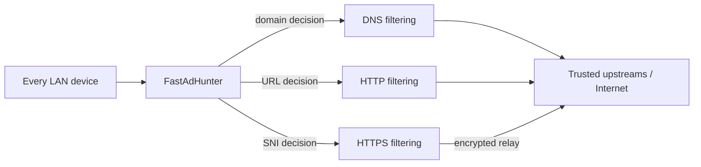

<div align="center">


# FastAdHunter

### Serious, network-wide filtering for every device you own.

Protect browsers, phones, TVs, consoles, and IoT devices from one small,
privacy-conscious service at the edge of your network.

**DNS filtering · HTTP URL filtering · HTTPS SNI filtering · DoT / DoH · Live observability**

[Why FastAdHunter](#why-fastadhunter) ·
[Production readiness](#production-readiness) ·
[Deploy on MikroTik](docs/deploy-rb5009.md) ·
[API reference](API.md)

</div>

---

## Your network. Quieter, faster, and under your control.

FastAdHunter is an API-first network filter for homes, labs, and small
networks. A single ARM64 container protects the devices that cannot install an
ad blocker: mobile phones, smart TVs, game consoles, thermostats, and every
browser on the LAN.

It applies the right decision at the right layer. DNS names are filtered before
resolution, HTTP URLs before an origin is contacted, and HTTPS host names at
the TLS SNI—while the allowed HTTPS session remains encrypted end to end.

| What you get | Why it matters |
| --- | --- |
| **One deployment, every device** | Protection follows the network, not a browser extension or client agent. |
| **Layer-appropriate filtering** | Block domains at DNS, URL paths at HTTP, and encrypted destinations at HTTPS SNI. |
| **Privacy by design** | Production HTTPS filtering reads only the TLS hostname; it does not decrypt browsing traffic or require a client CA. |
| **A calm control plane** | Dashboard, REST API, WebSocket events, and terminal monitor make behaviour visible in real time. |
| **Built for constrained hardware** | Bounded caches and queues, streamed bodies, atomic configuration swaps, and a small ARM64 image. |

> **Production posture**
>
> FastAdHunter is deployed on the reference MikroTik RB5009 in
> `dns+http+https` mode. The current source version is **0.4.3**; the documented
> reference production deployment is **0.4.1**. HTTPS interception is disabled
> there by design—production filtering is SNI-only and keeps HTTPS payloads
> opaque.



## Why FastAdHunter

DNS filtering is the broadest way to protect a network, but a domain-only
decision cannot distinguish a useful website from one unwanted path on that
same host. Browser extensions can be precise, but they leave every unmanaged
device behind.

FastAdHunter brings both control points to the network boundary:

- **DNS:** checks domains before cache or upstream resolution.
- **HTTP:** evaluates host, path, method, resource type, and client context
  before an origin connection is made.
- **HTTPS:** evaluates the hostname in the TLS ClientHello and relays allowed
  encrypted sessions without rewriting them.
- **Encrypted DNS:** accepts DoT and DoH from clients that use Private DNS.

One compiled Rule Engine serves DNS and HTTP policy. A URL rule stays a URL
rule—it never silently becomes a coarse whole-domain block.

## HTTPS filtering without inspection

The production HTTPS path is intentionally simple and explicit:

1. Read the TLS ClientHello and extract the Server Name Indication (SNI).
2. Apply host-level policy before an upstream connection is opened.
3. Relay allowed traffic as an opaque, encrypted session.

No FastAdHunter root certificate is installed on client devices in this path.
No page content is decrypted, stored, or rewritten. The result is practical
HTTPS host filtering with a privacy boundary that is easy to explain.

## Production readiness

The figures below are observed measurements from the reference deployment or
its deployed path. They are evidence, not universal promises: your rule corpus,
network, and workload determine the result.

| Measure | Observed result | Context | Target |
| --- | ---: | --- | ---: |
| Compiled rules | **766,499** from **1,198,086** source entries | v0.4.1, 16 public lists | corpus-dependent |
| Ruleset resident heap | **24.48 MiB** | v0.4.1 deployed ruleset | ≤ 40 MiB |
| Ruleset compile time | **2.92 s** | 1.20 M parsed rules | < 3 s |
| Sustained DNS throughput | **20k+ QPS** | historical deployed-path synthetic profile | ≥ 10k QPS |
| HTTP proxy added latency | **+344 µs p50** | historical opaque pass-through workload | < 1 ms budget* |
| Opaque HTTP throughput | **208–271 MiB/s** | historical pass-through workload | ≥ 100 MiB/s |
| ARM64 image | **14.07 MiB** | v0.3.0 image with dashboard | ≤ 30 MiB |

\*The historical latency statistic and target are not directly comparable;
they are retained to show the measured order of magnitude. Refreshing a large
ruleset temporarily holds old and new data together, so its memory transient is
intentionally documented as a bounded operational cost. See
[PERFORMANCE.md](PERFORMANCE.md) for methodology, budgets, and limits.

## Built to be operated, not babysat

<div align="center">

</div>

The dashboard is not a decorative shell over privileged internals. It uses the
same public interfaces as everything else:

- **REST API** for health, telemetry, clients, policies, lists, rules, cache,
  history, configuration, certificates, and diagnostics.
- **WebSocket live feed** for DNS, HTTP, HTTPS-SNI, and intercepted HTTPS
  decisions as they happen.
- **Terminal monitor** for low-overhead operation from an SSH session.

<div align="center">

</div>

```sh
cargo run --release -p fah-tui-monitor
```

The runtime is designed to remain predictable under load:

- DNS cache capacity is bounded by entry count **and** bytes.
- Stale answers can be served while a bounded worker refreshes them.
- HTTP and HTTPS bodies are streamed, never buffered wholesale.
- Rules and configuration change through atomic swaps.
- Slow observability consumers are disconnected rather than permitted to slow
  the filtering engine.

## Security, stated plainly

FastAdHunter is designed for a trusted management network, not for public WAN
administration.

| Control | Production behaviour |
| --- | --- |
| **Administrative API** | HTTPS by default; expose it only to a trusted management network. |
| **Automation** | A bearer API key is generated on first boot and stored under `/config`. |
| **Dashboard sign-in** | Argon2id password verification with signed `HttpOnly`, `Secure`, `SameSite=Strict` session cookies. |
| **HTTPS traffic** | SNI-only in the reference production configuration; no client CA and no traffic decryption. |
| **State** | Configuration, certificates, lists, sessions, and history are kept outside the image on persistent mounts. |

Read the full, precise security model in [SECURITY.md](SECURITY.md).

## Deploy with confidence

FastAdHunter is a statically linked, non-root ARM64 container. Keep state on
persistent mounts—not in the image:

```text
/config    configuration, API key, TLS certificate, authentication state
/data      cached lists, session state, and history
```

The production journey is deliberately staged:

1. Build the ARM64 image.
2. Attach persistent `/config` and `/data` storage.
3. Start with DNS filtering and verify the resolver path.
4. Enable `dns+http`, then `dns+http+https` when the preceding stage is proven.
5. Use the dashboard, API, and live feed to verify clients, decisions, and
   listener health before calling the rollout complete.

```sh
docker buildx build --platform linux/arm64 \
  -t fastadhunter:0.4.3 \
  -o type=docker,dest=fastadhunter-arm64.tar .
```

The complete RB5009 guide covers image conversion, RouterOS placement,
verification, and rollback:
[Deploy FastAdHunter on a MikroTik RB5009](docs/deploy-rb5009.md).

Configuration precedence is built-in defaults, TOML, environment variables,
then validated API changes. Start with [CONFIGURATION.md](CONFIGURATION.md).

## Designed for a specific job

FastAdHunter is deliberately focused. It is **not** a browser extension,
antivirus product, intrusion-detection system, general-purpose firewall, or
cosmetic DOM filter. It is a network filtering engine that prioritizes
measurable latency, bounded memory, streaming, and an intelligible operational
surface over feature count.

## Explore the platform

| Start here | Go deeper |
| --- | --- |
| [Deploy on the reference RB5009](docs/deploy-rb5009.md) | [Architecture](ARCHITECTURE.md) |
| [Configuration reference](CONFIGURATION.md) | [Rule Engine](RULE_ENGINE.md) |
| [API reference](API.md) | [Performance budgets and measurements](PERFORMANCE.md) |
| [Security model](SECURITY.md) | [Roadmap](ROADMAP.md) |

Explore the system visually in [`docs/diagrams`](docs/diagrams):
[overview](docs/diagrams/architecture.svg),
[detailed architecture](docs/diagrams/architecture-full.svg),
[interactive diagram](docs/diagrams/architecture.html), and
[PNG export](docs/diagrams/diagram.png).

Built with Rust, Tokio, Hyper/Axum, Hickory, rustls, rcgen, Argon2id, and
Preact.
