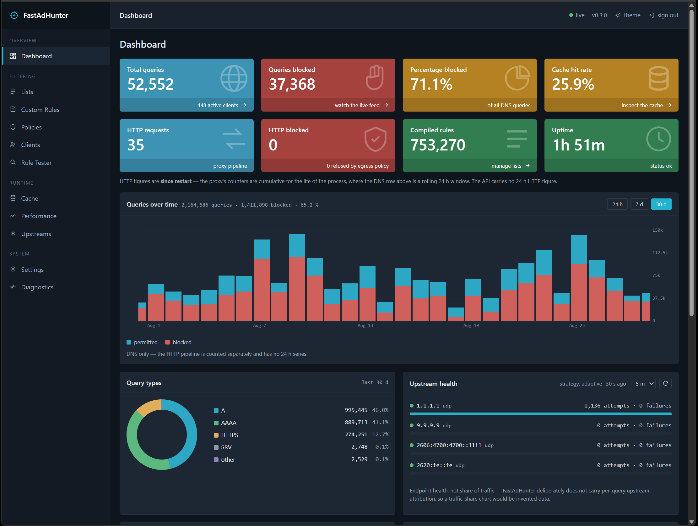
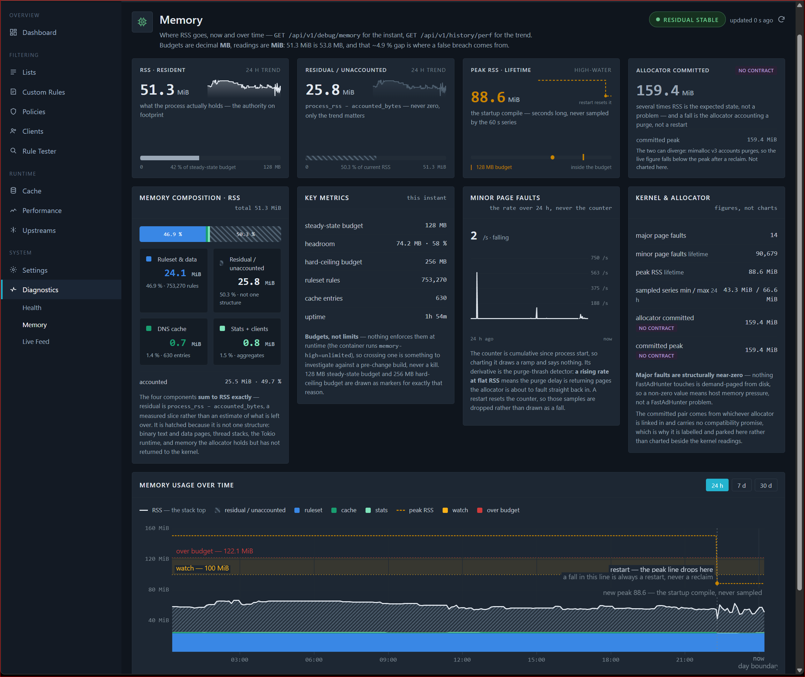
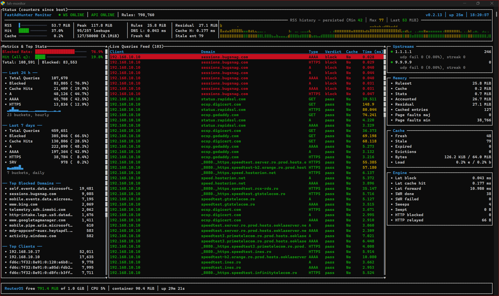
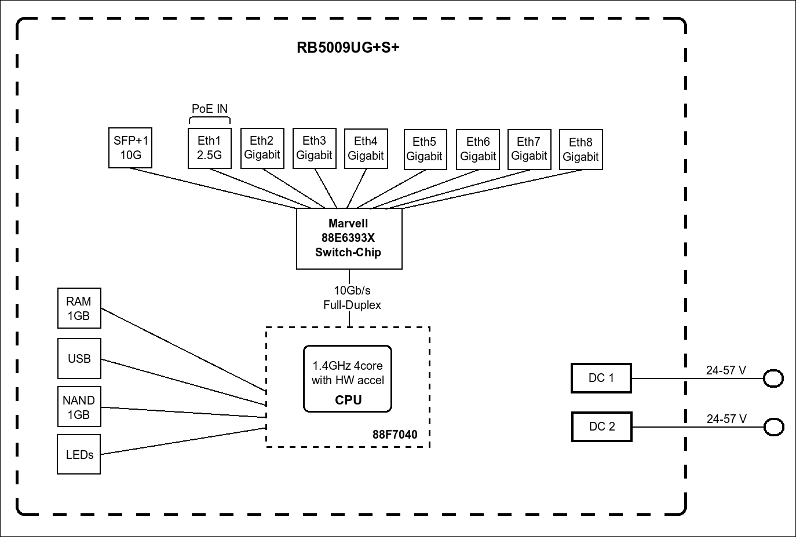

# FastAdHunter

> Network-wide ad blocking with predictable latency and the smallest memory
> footprint we can defend with a measurement.

**Rust** · **Tokio** · **API-first** · **ARM64-first** · **Docker-native** ·
**Multi-core**

---

## What it is

A network filtering engine that sits between every device in a house and the
internet. One container on the router, no client configuration, no browser
extension, no per-device agent.

It filters **DNS and HTTP today**. HTTPS filtering at the SNI plus the DoT/DoH
listeners (Phase 3) are built and on `main`, **not deployed**; they ship with
interception off, so nothing is ever decrypted. HTML filtering (Phase 4) is
designed and not started.

**Performance is the primary feature.** Every architectural decision is
evaluated by its effect on throughput, latency and allocations — and the
numbers below are measured on the target hardware, not estimated.

---

## Status

| Phase | Scope | Status | Tag |
| ----- | ----- | ------ | --- |
| 0 | Foundations, workspace, layering | ✅ done | `v0.1.0-phase0` |
| 1 | DNS + REST API + Docker | ✅ done | `v0.2.0-phase1` |
| 1.5 | Observability persistence | ✅ done | `v0.3.0-phase1.5` |
| 2 | HTTP engine + Policies | ✅ done | `v0.2.17-phase2` |
| 2.5 | Pre-Adaptive hardening | ✅ done | `v0.2.19-phase2.5` |
| 2.6 | Adaptive DNS Stage 1 | ✅ done — closed 2026-09-07; `adaptive` is the only strategy since p2.6-12, on `main` from 2026-09-11 | `soak-p2.6-11` |
| 5 | Web dashboard | ✅ done — closed 2026-09-01, four verification rows deferred to the next deploy window | `0.3.0` |
| 3 | HTTPS at the SNI + DoT/DoH | 🚧 on `main` since 2026-09-13 — p3-01…p3-05 and p3-07…p3-09 done. **It is SNI-only + DoT/DoH because interception is off**: the owner decided on 2026-09-13 not to use the interception code, so nothing is decrypted and p3-06 and p3-06b are parked. p3-10 and p3-11 open, and it is **not deployed** | `main`, untagged |
| 4 | HTML filtering | ⬜ not started | — |

Rows are in **execution** order, which is not numeric order: the dashboard is
numbered 5 by capability and scheduled ahead of HTTPS and HTML filtering because
that is what the household needs next.

Running in production on a MikroTik RB5009 as the household's only resolver, in
`dns+http` mode, on **0.3.4** since 2026-09-11 (0.3.x since 2026-08-29). Phase
2's engine work is deployed — the transparent HTTP proxy, URL-path rules,
per-client Policies and the single JSON telemetry surface — and so is the Phase
5 dashboard. Since 0.3.2 the HTTP engine runs on **allocation domains**
([ADR-0006](docs/decisions/0006-http-allocation-domains.md)): each HTTP
connection is served end to end on one of two single-thread runtimes, so its
allocations are freed by the thread that made them — on the RB5009 a third less
CPU per request than the shared runtime, and a third of its held memory after a
900 MiB transfer.

Phase 2.5 was hardening, not features: the live-resolver defects an architecture
review found (a DNS listener that could die silently, a 200-OK garbage list body
that could replace a good ruleset), the encrypted-transport fixes adaptive
upstream selection depends on, and the outcome telemetry that makes it judgeable
— a served SERVFAIL is now countable, a forwarded query's event names which
upstream answered it, and every endpoint reports the length distribution of its
failure runs.

Phase 2.6 is the first adaptive step, specified and frozen before a line of it
was written: an upstream that stops answering is penalized after a few
consecutive transport failures, skipped at the cost of one relaxed atomic load,
and probed for recovery on the query path — no background task, no timer, no
RTT ranking, no hedging. It has run in production under `strategy = "adaptive"`
since 2026-08-25. Its first 7-day soak was **terminated on day 5** once the RSS
excursions it was watching were traced to their real cause — list refreshes
downloading unchanged bodies, not the adaptive code — and two more observation
days would have added nothing. The fix (conditional GET, `If-None-Match` /
`If-Modified-Since` with a 304 short-circuit) shipped in 0.3.0. The re-soak on
0.3.0 was then **terminated at T0+59 h to change the measurement method, not on
a gate**, so it carries no verdict. The third soak, **0.3.1 from
2026-09-01T07:27 Z, was stopped on day 6 (2026-09-07)** for the
allocation-domain production swap, and the phase closed that day by owner
decision. Two deployment gates closed **unvalidated** — the observed failure
window held three runs, all of length 1, too few to calibrate
`penalty_failures`, which therefore stays at its compiled default of 2,
provisional and uncalibrated. The default flip (p2.6-12) landed on `phase3-06`
and reached `main` on 2026-09-11: `adaptive` is the **only** strategy, the
`fallback` walk is deleted, and a config still naming it fails at load. The
removal rests on a controlled A/B at production timings — one dead upstream
ahead of three healthy ones costs `fallback` 831 ms per query and `adaptive`
31 ms, with no scenario favouring `fallback`
([strategy-ab-fallback-vs-adaptive.md](docs/code-review/phase2.6/strategy-ab-fallback-vs-adaptive.md)).

Phase 5 is the web dashboard, and it is **built** — thirteen screens across all
ten tasks, merged and released as 0.3.0. The shipped bundle is **128,730 B
gzip**, 83.8 % of the 150 KB budget, served by `fah-api` itself from the same
image and the same TLS listener: no second container, no Node in the runtime
image, no new port. On-device verification is **done** — Stage B ran read-only
against 0.3.1 as deployed at the time, which was already the phase-5 build: `/health`,
`/telemetry` and `/cache` answer in 0.89–1.05 ms warm, sequential Argon2id
verification sits at ~120 ms p50 with peak RSS unmoved. Four rows are
**deferred, not passed**, and want the next deploy window: concurrent Argon2id
peak RSS, RSS deltas above the drift floor, `/cache` at a second occupancy, and
the real-phone leg. Design record: [docs/dashboard/](docs/dashboard/).

Phase 3 landed on `main` on 2026-09-13 and is **not deployed** — that decision
has not been taken. What it delivers is HTTPS filtered at the SNI, DoT/DoH
listeners, and the certificate machinery behind both. The interception code is
compiled into the build but switched off: the Interception Document's `clients`
list is empty by owner decision, so every HTTPS connection is read at the SNI
and then relayed byte for byte. A test in the shipped configuration proves that,
rather than the configuration file asserting it. Two tasks remain open — p3-10
for the performance characterization and p3-11 for verification and a seven-day
soak — and both wait in part on the deploy decision. Before it can go live the
router has to refuse UDP 443 outbound, or HTTP/3 bypasses the listener.

A fourth soak is running meanwhile, on the deployed 0.3.4 since
2026-09-11T22:13 Z, reading the container hourly to ~2026-09-18. Its counters
set the final `dns.tcp_max_connections` default, which today ships at a
provisional 1024.

### Measured, on the RB5009

Quad-core ARMv8 @ 1.4 GHz, 1 GB RAM shared with RouterOS. Every figure comes off
the deployed container, not a dev box. **Measurements are binary (MiB);**
PERFORMANCE.md writes its budgets in decimal MB, which runs ~4.9 % higher for the
same reading. **Each row carries the build it was measured on.** The ruleset and
boot rows are 0.3.0; the steady-state memory, refresh transient, latency and
throughput rows still describe 0.2.x and have not been re-taken on 0.3.x.

| | Measured | Build | Budget |
| --- | ---: | :---: | ---: |
| Resident memory, 50 k-entry cache warm | **53.6 MiB** | 0.2.x | ≤ 128 MB |
| Peak RSS at boot, compiling from cached lists | **88.6 MiB** | 0.3.0 | ≤ 128 MB |
| Peak RSS during a list refresh | **171.7 MiB** | 0.2.x | see below |
| Ruleset compile, 1.20 M parsed rules | **2.87 s** | 0.3.0 | < 3 s |
| Ruleset heap, resident | **24.06 MiB** | 0.3.0 | ≤ 40 MB |
| Blocked verdict, in-engine | **0.045 ms** mean | 0.2.x | < 1 ms p99 |
| Cache hit, fresh + stale-while-refresh | **0.227 ms** mean | 0.2.x | < 1 ms p99 |
| HTTP proxy, added latency | **+161 µs** min · **+344 µs** p50 | 0.2.x | < 1 ms |
| HTTP proxy, opaque throughput | **271 / 208 MiB/s** | 0.2.x | ≥ 100 MiB/s |
| URL verdict, 8 KiB URL, full EasyList+EasyPrivacy | **554 µs** | 0.2.x | < 1 ms |
| Sustained DNS throughput, deployed path | **20 k+ QPS** | 0.2.x | ≥ 10 k QPS |
| Container image, arm64 rootfs, with dashboard | **14.07 MiB** | 0.3.0 | ≤ 30 MB |
| Dashboard bundle, gzip | **128,730 B** | 0.3.0 | ≤ 150 KB |
| Dropped events under real load | **0** | both | 0 |

Rule lists compile **1 200 902 parsed rules into 753 270** after deduplication —
447 632 duplicates, **37.3 % of the input** across 16 public lists. Deduplication
is paid once at compile time and keeps the matcher smaller for the life of the
process. It also shortens probe chains: a domain carried by two lists occupies
one slot instead of two that hash to the same place, worth **46 % on lookups for
shared domains**.

Those counts move with the lists, not with the code: the same 16 sources parsed
1 148 024 rules into 798 760 at 30 % duplication a month earlier. The overlap
between public lists is what grew.

The 20 k+ QPS figure is `/tool profile` on the live box under a synthetic hammer,
with all four cores sharing evenly — reception is not the bottleneck, so
`SO_REUSEPORT` stays a documented recipe rather than shipped code.

**The refresh transient is the one figure above its budget.** Recompiling the
ruleset briefly holds the outgoing matcher, the freshly fetched list bodies and
the new arena at the same time, peaking around 172 MiB before falling back to
~52 MiB. It is bounded and it does not ratchet — steady RSS returning after every
refresh is the evidence — but it is real.

It was accounted for rather than optimised away: 106.61 MB of the 125.69 MB
device transient is explained exactly, the dominant term being the *parsed* form
of a list rather than the compiled arena it becomes. The levers are sized and
deliberately **not taken** — the largest, list ordering, is worth ±19.92 MB but
changes the compiled ruleset, and the deployment already sits at the best case.
Phase 2 closed with zero code on this, and the peak is instead **observable**:
`getrusage`'s high-water mark rides `/history/perf`, so a refresh step appears in
the series without anyone having to watch for it.
[Attribution](docs/code-review/phase2/p2-12-compile-transient-attribution.md).

Memory is otherwise **bounded, not merely small**, and the instrument that proves
it runs continuously: `RSS − Σ(components) = residual` is exported on every
sample, so a leak shows as the residual growing while the named components stay
flat — the growth you legitimately expect has already been subtracted out. Across
two independent on-device windows of 61.3 h and 36.2 h (4 657 samples), the
residual slopes are **+0.082 and +0.027 MiB/h**, with the sign disagreeing between
the windows' final thirds: drift indistinguishable from noise.

> RouterOS reports the container larger than the process is. `memory-current` sits
> around 78 MiB against a ~54 MiB resident set; the difference is cgroup **page
> cache** — reclaimable file-backed pages from the image layers and the cached
> rule lists — not consumption. The figure that matters is the process's own
> resident set.

---

## Why it exists

Existing solutions each cover one layer:

- **DNS filters** — blind to paths; blocking `example.com` to kill one tracker
  takes the whole domain with it.
- **Browser extensions** — excellent, but per-browser and per-device. Nothing
  protects the TV, the thermostat or a guest's phone.
- **Desktop applications** — per-machine, per-OS.

FastAdHunter filters at the network layer and is designed to grow from DNS to
HTTP to HTTPS **without changing its architecture**.

It does not try to replace uBlock Origin. A router cannot see a page's DOM;
cosmetic filtering belongs where the DOM is. What a router can do is protect
every device in the house at once, including the ones that will never run an
extension.

---

## Philosophy

Deterministic behaviour over configurability. Allocations minimised. Streaming
preferred over buffering. Expensive operations avoided rather than optimised.

**Every new capability must justify its runtime cost.** Feature count is always
secondary.

### Design rules

- Performance before features
- API-first — the engine never depends on a UI
- No locks, no allocations, no regex on the hot path
- Ruleset and config changes via atomic swap
- **Bounded everything** — memory must not grow with traffic or uptime
- Streaming before buffering; zero-copy where practical
- ARM64 first-class
- No hand-rolled cryptography

The Rule Engine runs **before** the cache, so rule changes take effect instantly
and the cache never stores verdicts
([ADR-0001](docs/decisions/0001-rules-before-cache.md)).

---

## Architecture


```text
             Dashboard (served by fah-api,
                        talks only to the API)
                     │
          REST / WebSocket API  (fah-api)
                     │
             FastAdHunter Core
                     │
 ┌─────────────────────────────────────┐
 │ DNS Engine        (fah-dns)         │
 │ HTTP Engine       (fah-http)        │
 │   HTTP + HTTPS listeners, one       │
 │   accept loop, shared domains       │
 │ Rule Engine       (fah-rules)       │
 │ Statistics        (fah-stats)       │
 │ Metrics           (fah-metrics)     │
 └─────────────────────────────────────┘
                     │
                 Internet
```

The dashboard is a separate deliverable and talks only to the API — it is served
*by* `fah-api` as static files baked into the same image, but it holds no
privileged path into the engine and would work unchanged against a remote
appliance. The core never depends on any UI.

Full diagram: [SVG](docs/diagrams/architecture.svg) ·
[HTML](docs/diagrams/architecture.html) ·
[detailed](docs/diagrams/architecture-full.svg)

### Dependency layering

```text
L4:  fastadhunter (binary — wires everything)
L3:  fah-dns   fah-http   fah-api   fah-stats   fah-metrics
L2:  fah-rules   fah-certs
L1:  fah-model   fah-config   fah-common   fah-logging
```

Dependencies point **downward only**; **siblings never import each other** — the
binary wires them via channels and ports. `fah-model` stays pure data.

This is enforced, not just documented: `crates/fastadhunter/tests/layering.rs`
parses every manifest and fails the build on any edge that points sideways or up.

---

## One Rule Engine, two pipelines

This is the central idea of the project.

```text
                        ┌─────────────────────────┐
                        │      Rule Engine        │
                        │       (fah-rules)       │
                        │                         │
                        │  ONE compiled index     │
                        │  ONE atomic swap        │
                        │  contiguous arena       │
                        └────────────┬────────────┘
                                     │
                   one typed entry point per request model
                                     │
                 ┌───────────────────┴───────────────────┐
                 │                                       │
         lookup_dns(domain, qtype)          lookup_http(host, path,
                 │                            method, type, client)
                 │                                       │
                 ▼                                       ▼
        ┌─────────────────┐                     ┌─────────────────┐
        │  DNS pipeline   │                     │  HTTP pipeline  │
        │    (fah-dns)    │                     │   (fah-http)    │
        └─────────────────┘                     └────────▲────────┘
                                                         │
                                          HTTPS, after TLS termination
                                          reuses the SAME request model
                                                    (Phase 3)
```

**One list of rules protects every protocol.** Add a blocklist once and DNS,
HTTP and later HTTPS all start enforcing it — there is no second ruleset to
configure, no second copy in memory, and no way for the two to disagree about
whether a domain is blocked.

The matcher is **protocol-model aware, not transport aware**. It never sees a
socket, a datagram, TCP or TLS — only a DNS question or an HTTP request. That is
what lets one index serve both:

- **A DNS question** is `(domain, qtype)`. It cannot express a path, so a rule
  like `||example.com^*/ads/banner.gif` is stored and classified but stays
  inactive on this path — blocking the whole domain to kill one tracker would be
  wrong.
- **An HTTP request** carries host **plus** path, method, resource type and
  third-party flag, so the same rule matches exactly what it was written for.
- **HTTPS** reuses the HTTP request model after TLS termination. No third
  matcher, ever — a `lookup_https()` would mean transport had leaked into the
  engine.

Two typed entry points, not a trait object: virtual dispatch on the hot path is
forbidden by [PERFORMANCE.md](PERFORMANCE.md). The rules themselves stay
model-specific — `$dnstype` is meaningless for HTTP, path anchoring is
meaningless for DNS — while the arena, the deduplication and the atomic swap are
paid for once.

### Policies — the same ruleset, seen differently per client

A **Policy** is a named bundle of lists and settings, assignable per client and
per schedule.

Every policy shares **one** compiled ruleset and carries a 16-bit per-rule
visibility mask, so N policies cost **+2.03 MiB flat** at deployed scale — 6.839
MiB shared, against 12.099 MiB if each policy compiled its own, measured over four
lists. A deployment with no policies allocates nothing extra, and resolving a
client's policy costs **+8.5 ns** per query, documented rather than claimed as
free.

Schedules are POSIX TZ strings, DST-correct, with no tzdb dependency.

---

## Request processing

### DNS pipeline

```text
Receive query (UDP/53, TCP/53)
      │
Rule Engine ── verdict
      │
      ├─ Block  → synthesize 0.0.0.0 / ::  (TTL 10s) ──► Reply
      │           never touches cache or network
Cache lookup ── hit ────────────────────────────────► Reply
      │ miss
Upstream resolver (UDP/TCP → DoT / DoH per config)
      │
Cache store
      │
Reply
```

Every query gets a fresh verdict, so unblocking a domain needs no cache flush.
The cache stores upstream answers only — bounded by both entry count **and**
bytes, TTL-respecting with clamps, and RFC 2308 negative caching.

#### An expiring entry never costs a client a round trip

A cache entry passes through three states: **fresh** → **stale** → **expired**.
The interesting one is stale.

```text
past TTL, still within the stale window
      │
      ├─► answer the client NOW from cache        (microseconds, not 20–50 ms)
      │   with a short retry-soon TTL
      │
      └─► hand the refresh to a detached worker pool
          the query path never awaits it
```

Naively, every client asking during the gap between expiry and the next refresh
pays a full upstream round trip — **and they all pay it in parallel**.
FastAdHunter answers from cache immediately and refreshes in the background on a
fixed pool of `swr_workers` (default 3), so the tail disappears without the
client ever knowing there was one.

Many simultaneous requests for the same expiring name produce **exactly one**
refresh. The deduplication claim lives inside the cache entry and is taken under
the shard lock the lookup already holds — no global lock, no second data
structure ([ADR-0005](docs/decisions/0005-serve-stale-while-refresh.md)).

The pool **never back-pressures**: enqueue is a `try_send`, and a full queue
drops the refresh rather than delaying anybody. Over a 15 h window on the
reference deployment: 5 579 refreshes queued, 5 579 completed, 0 failed,
0 dropped.

A background sweep removes entries past the stale window every
`cleanup_interval_seconds` (default 360), on the blocking pool and one shard at a
time. It is **not** a bound — `max_entries`/`max_bytes` are, and they hold with
the sweep disabled — it returns memory a cache stops needing while idling *below*
both caps, which nothing else reclaims.

### HTTP pipeline

```text
Accept (TCP :8080, router dst-nats :80 here)
      │
Read request line + headers   ── timeout bounds a slowloris
      │
Rule Engine ── URL verdict (host + path + method + resource type + client)
      │
      ├─ Block → synthesized response, origin never contacted ──► Client
      │
Egress guard ── default-deny, post-resolution (SSRF / DNS rebinding)
      │
Pass-through: stream origin ⇄ client, byte for byte
```

**The body is never parsed and never buffered.** Images, archives, PDFs and video
stream through untouched — buffering a response to inspect it would make memory
grow with traffic, which the bounded-everything rule forbids outright. HTML
rewriting is Phase 4 — not started — and will be opt-in, for that content type
alone.

The verdict is taken on the **head**, before the origin is resolved, so a blocked
request costs no DNS lookup and no upstream connection — measured **48–55 %
cheaper than a forwarded one** on the device.

Every rule is indexed — the unindexed count is **zero**, because a literal-run
n-gram tier covers the patterns a token index cannot. That holds a worst-case
8 KiB URL against the full EasyList + EasyPrivacy corpus to **554 µs** on-device.
The unanchored scan uses SIMD `memchr` — a single-byte search, which is the one
primitive the "no regex on the hot path" rule leaves open.

---

## Operating modes

Fixed at container start via `engine.mode`:

| Mode | Filters |
| ---- | ------- |
| `dns` | Network-wide DNS filtering |
| `dns+http` | …plus URL-level filtering of unencrypted HTTP — **deployed today** |
| `dns+http+https` | …plus SNI-level HTTPS filtering for every client — the connection is read at the SNI and then relayed untouched, never decrypted — and DoT/DoH listeners for Private DNS |

The mode opens the HTTPS listener. It does **not** decide interception: that is
the Interception Document's `clients` list, **empty since 2026-09-13** by owner
decision, so every connection is spliced (SECURITY.md). The interception code
ships compiled and a later decision can switch it on; turning it on means
installing our CA on the device, and most mobile apps pin or ignore the user
store and have to be excluded per host.

Whatever the mode, the router must refuse UDP 443 outbound — otherwise HTTP/3
bypasses the listener entirely and nothing above applies.

A mode that does not name an engine means that engine's listener is **never
bound** — not bound and idle.

---

## Runtime model

```text
               Tokio Runtime (multi-thread)
                     │
      ┌──────────────┼──────────────┐
      │              │              │
 Worker 1       Worker 2       Worker N
      │              │              │
      ├── DNS        ├── DNS        ├── DNS
      ├── API        ├── API        ├── API
      └── Rules      └── Rules      └── Rules

 HTTP + HTTPS acceptors (one each, on the shared runtime)
      │ round-robin hand-off over bounded channels
      ├── fah-http-0   current_thread runtime on its own OS thread,
      └── fah-http-1   serves the connection end to end
```

DNS and the API are distributed across Tokio workers; the architecture avoids
centralised processing. One task per datagram, one shared compiled ruleset
behind an atomic swap, and no lock on the path that answers a query.

HTTP and HTTPS connections are the one exception
([ADR-0006](docs/decisions/0006-http-allocation-domains.md)): each listener
keeps one acceptor on the shared runtime, and every accepted socket is handed
to one of `[runtime] http_runtimes` **allocation domains** — single-thread
runtimes on their own OS threads that serve the connection end to end, hello
peek and TLS handshake included, so what a connection allocates is freed by the
thread that allocated it. The RB5009 runs two.

Since 0.3.2 HTTP connections are the exception: each is served end to end on
one of `runtime.http_runtimes` (default 2) single-thread runtimes on their own
OS threads behind one acceptor — allocation domains,
[ADR-0006](docs/decisions/0006-http-allocation-domains.md) — so the shared
runtime carries DNS, rules and the API.

---

## API

Everything the engine can do is reachable over REST + WebSocket. HTTPS by
default. Two authenticators sit side by side: a bearer key for programs, and an
Argon2id password issuing an HMAC-signed session cookie for the dashboard —
accepted on REST and on the WebSocket upgrade alike. `/health` and the login
route are the only unauthenticated ones.

```text
GET   /health
POST  /api/v1/auth/login            password → session cookie
POST  /api/v1/auth/{logout,logout-all}
PUT   /api/v1/auth/password
GET   /api/v1/telemetry             whole engine state as JSON: counters,
                                    latency stages, upstreams, cache, memory
GET   /api/v1/stats                 aggregates, top domains/clients
GET   /api/v1/clients               per-client view; PUT to name one
PUT   /api/v1/clients/{ip}/policy   assign a policy to a client
GET   /api/v1/policies              policy CRUD, schedules, assignments
GET   /api/v1/lists                 rule lists; POST /lists/refresh
GET   /api/v1/rules/user            user rules; PUT to replace
POST  /api/v1/rules/test            verdict for a domain, with the rule
GET   /api/v1/cache                 cache stats; POST /cache/clean
GET   /api/v1/history/{summary,perf,top}
GET   /api/v1/config                POST to patch, validated + written back
POST  /api/v1/config/apikey/rotate  rotate the bearer key
GET   /api/v1/debug/memory          per-component heap + residual
WS    /api/v1/events                live query stream
```

**The read surface is JSON only — there is no Prometheus endpoint.**
`/api/v1/telemetry` is the single snapshot: one document carrying counters,
latency stages, upstreams, cache and memory, so a dashboard reads the rule count
without parsing a text exposition format. Percentiles come from `/history/perf`,
windowed; `/telemetry` serves `count` + `sum_seconds`, which are means.

Metrics are placed by **producer**: application and kernel figures live on
`/telemetry`, a stable contract; allocator internals live on `/debug/*`, which is
free to change.

Full request/response shapes: [API.md](API.md).

---

## Web dashboard

Served by `fah-api` itself as pre-compressed static files baked into the same
image, on the existing TLS listener. No second container, no Node in the runtime
image, no new port. Login is an Argon2id password; the session is an HMAC-signed
cookie, carried on REST calls and on the WebSocket upgrade.



Thirteen screens: Dashboard · Lists · Custom Rules · Policies · Clients · Rule
Tester · Cache · Performance · Upstreams · Settings · Health · Memory · Live
Feed. **Every rendered figure traces to an API field** — the capability matrix
was the gate, and a screen with no endpoint behind it was cut rather than faked.
That is why the upstream panel above says *endpoint health, not share of
traffic*: per-query upstream attribution does not exist in the telemetry, so a
traffic-share chart would be invented data.

An inactive page performs approximately zero API work; fetching is route-scoped,
and the polling interval is per-panel rather than global.



The Memory screen is the clearest example of the rule. It renders the same
identity the engine exports — `RSS − Σ(components) = residual` — rather than a
prettier approximation of it, labels every reading binary against decimal
budgets, and says out loud which numbers cannot be compared: peak RSS resets on
restart, and the allocator's committed figure carries no compatibility promise,
so it is parked as a figure instead of charted beside the kernel readings.

---

## Terminal monitor

`fah-tui-monitor` is a live console dashboard for a running instance, and it
predates the web one. It ships in this workspace and is the proof that the
API-first rule holds: it reads **nothing** but REST and WebSocket, has no
privileged access to the engine, and would work unchanged against a remote
appliance.



It polls `/api/v1/telemetry` on an interval and streams `WS /api/v1/events` for
the live query feed, so the expensive figures refresh slowly and the feed stays
instant.

- **Header** — RSS, peak, ruleset and residual; cache hit ratio over *lookups*;
  cache load; and a persisted RSS history graph coloured by threshold.
- **Live feed** — every query as it is decided: client, domain, type, verdict,
  cache outcome and latency.
- **Windows** — 24 h and 7 d rollups with hourly and daily sparklines, top
  blocked domains and top clients.
- **Right column** — upstream health, the memory breakdown, cache state, and the
  engine's three latency stages (`block`, `cache hit`, `forward`), which together
  partition every resolved query.

Two figures on that screen are easy to misread, so it names them precisely:
`Stale ent` is the count of entries *currently* in the stale window, not the
number of stale serves; and every byte figure is binary, labelled `MiB`, because
the API serves raw bytes and a decimal-MB reading of the same number runs 4.9 %
higher.

A frame the build cannot decode is counted and shown rather than silently
dropped — otherwise a renamed server field would empty the feed in silence.

```sh
cargo run --release -p fah-tui-monitor
```

Host, port and bearer token come from `tui-monitor/config.toml`.

---

## Deployment

One container. Configuration, blocklists, certificates and history live on
mounted volumes, outside the image.

```text
/config    small, back this up      TOML, API key, TLS certificates
/data      bulky, regenerable      cached lists, snapshots, history
```

The image is distroless/static with a statically linked musl binary — no shell,
no package manager, non-root after binding.

Step-by-step for the reference deployment, including the RouterOS container
setup, port redirects and the soak procedure:
**[docs/deploy-rb5009.md](docs/deploy-rb5009.md)**.

---

## ARM64 first

The primary target is ARM64 hardware in routers, home labs and small servers. The
reference deployment is a **MikroTik RB5009UG+S+IN** running the container
natively under RouterOS.



> Compact, powerful, with multiple powering options and efficient cooling. Nine
> wired ports and a full-sized USB 3.0 port — seven Gigabit Ethernet, one
> 2.5 Gigabit Ethernet, and a 10G SFP+ slot. All connected to a Marvell Amethyst
> switch chip with a 10 Gbps full-duplex line to the Marvell Armada quad-core
> ARMv8 1.4 GHz CPU. Both the CPU and the switch chip sit on the bottom of the
> board, so the case acts as a massive heatsink. Hardware offload supported.

Budgets assume this box: four ARMv8 cores and **1 GB of RAM shared with RouterOS
itself**. That constraint is why the memory numbers matter.

Dynamic frequency scaling is enabled: during CPU-bound benchmarks the governor
boosts between idle (350 MHz) and 1400 MHz, and control measurements show
throughput unchanged between runs reporting those frequencies. Clock readings
therefore cannot calibrate performance here — the reference is the measured **~9×
x86 → RB5009 factor**, which **does not convert HTTP work**, where the observed
spread is 4.55–10.09×.

### What encryption costs on this CPU

Measured 2026-09-15 by a throwaway probe container — `veth3`, no mounts, no
sockets, four seconds of work, the live resolver never stopped. It calls the
bulk AEAD that rustls calls underneath its record layer, `aws-lc-rs` seal and
open over 16 KiB records, so what it times is encryption and nothing else. Two
runs agreed inside 1 % on almost every arm; worst case 3.6 %.

**AES-128-GCM costs ~1.0 ms/MiB on one core.** A gigabit is 119.2 MiB/s, so
line-rate encryption is about **12 % of one core**, and there are four. AES beats
ChaCha20-Poly1305 by **5.3×**, which is how you know the ARMv8 crypto extensions
are present and used — on a CPU without them that ranking inverts and ChaCha
would be the right default here. The same arm runs at 0.107 ms/MiB on the x86 dev
box, so this is also an independent **9.3×** check on the conversion factor
above, on a workload that is purely CPU.

It says nothing about reaching a gigabit end to end. The NIC, the router's
forwarding path (~67–70 MiB/s) and the scheduler are all unmeasured, and the
shipped build terminates no TLS on the proxy path at all — an HTTPS connection is
read at the SNI and relayed byte for byte. This cost belongs to the DoT listener,
to DoH and to the API, not to the path that carries browsing traffic. Full
result, with its limits:
[p3-10-track-b2-rb5009.md](docs/code-review/phase3/p3-10-track-b2-rb5009.md).

---

## Repository layout

```text
FastAdHunter/
├── Cargo.toml            # workspace root
├── crates/
│   ├── fah-common/       # shared errors, listener binding, small utils
│   ├── fah-logging/      # tracing init, formats, levels
│   ├── fah-config/       # TOML, precedence, validation
│   ├── fah-model/        # domain model + shared DTOs (pure data types)
│   ├── fah-rules/        # Rule Engine: parsers + compiled matchers
│   ├── fah-certs/        # CA + leaf minting, PEM import, public-only export
│   ├── fah-dns/          # listeners, pipeline, cache, upstreams
│   ├── fah-http/         # HTTP engine: proxy, pass-through, URL filtering
│   ├── fah-api/          # Axum REST + WebSocket
│   ├── fah-metrics/      # ops telemetry: counters + stage histograms
│   ├── fah-stats/        # product data: aggregates, clients, history
│   └── fastadhunter/     # thin binary — wires everything
├── tui-monitor/          # fah-tui-monitor — live console dashboard
├── tests/                # workspace integration tests
├── benches/              # criterion benches vs PERFORMANCE.md budgets
├── plan/                 # task orchestration: open / wip / closed phases
├── docs/                 # decisions/, design/, diagrams/, images/,
│                         # code-review/, solutions/
└── dashboard/
    └── frontend/         # Vite + TypeScript + Preact; built into the image
```

---

## Technology

| Area | Choice | Why |
| ---- | ------ | --- |
| Language | Rust | no GC pauses, no runtime, predictable memory |
| Runtime | Tokio | work-stealing workers for DNS and the API; current-thread allocation domains for HTTP and HTTPS |
| HTTP | Hyper / Axum | streaming-first |
| DNS | Hickory | pure-Rust wire format and upstream clients |
| TLS | rustls | no OpenSSL, no C dependency |
| Certificates | rcgen · x509-parser | generation and parsing only |
| Password / session | argon2 · aws-lc-rs | Argon2id hash; constant-time HMAC-SHA256 cookie |
| Dashboard | Vite · TypeScript · Preact · uPlot | build-time only — nothing of it enters the runtime image but static files |
| Allocator | mimalloc | +27 % throughput, −17 % CPU/query vs mallocng |
| Scanning | memchr | SIMD single-byte search — not regex |
| Terminal UI | ratatui | the monitor only; the engine has no UI dependency |
| HTML | lol_html *(Phase 4)* | streaming rewriter, never buffers a document |

> **Rule:** do not reinvent cryptography. rustls, rcgen and x509-parser are the
> complete crypto surface.

---

## Scope

**FastAdHunter is:** lightweight · modular · predictable · API-first ·
network-wide.

**FastAdHunter is not:** a browser · an IDS · an antivirus · a general-purpose
firewall · a replacement for a good browser extension.

---

## Roadmap

| Phase | Delivers |
| ----- | -------- |
| **1** ✅ | DNS filtering, REST API, Docker image, on-device soak |
| **1.5** ✅ | Persisted history, perf series, byte-bounded cache |
| **2** ✅ | HTTP proxy, URL-path rules, Policies, telemetry consolidation, compile-transient attribution |
| **2.5** ✅ | Listener resilience, list-refresh integrity, encrypted-transport fixes, outcome telemetry, failure run-length telemetry — hardening before adaptive upstream selection |
| **2.6** ✅ | Adaptive DNS Stage 1 — per-endpoint health, penalty and skip on repeated transport failure, on-path recovery probing; in production opt-in since 2026-08-25, closed 2026-09-07; `adaptive` is the only strategy and `fallback` is deleted since p2.6-12 (on `main` from 2026-09-11). Shipped alongside as 0.3.2: HTTP allocation domains (ADR-0006) |
| **5** ✅ | Web dashboard — thirteen screens, 128,730 B gzip at 0.3.0, served by `fah-api` on one origin, session-cookie auth, every figure backed by an endpoint that exists; released as 0.3.0, closed 2026-09-01 with four verification rows deferred |
| **3** 🚧 | HTTPS filtered at the SNI with no decryption, certificate management, DoT/DoH listeners, live Interception Document + client-rejection view (ADR-0008) — on `main` since 2026-09-13, **not deployed**. The interception code ships compiled but switched off by owner decision, which is why the delivered capability is SNI + DoT/DoH. p3-10 (performance characterization) and p3-11 (verification and the seven-day soak) are open; both wait in part on the deploy decision |
| **4** ⬜ | HTML filtering with `lol_html`, cosmetic rules — not started |

Execution order is 2.5 → 2.6 → **5** → 3 → 4. Each of Phases 3 and 4 sends the
dashboard back for a capability re-review: Phase 3's certificate screens and
client-rejection view landed with p3-09, and Phase 4 will change what the
rule-partition figures mean.

Detail and per-phase task status: [ROADMAP.md](ROADMAP.md) and `plan/`.

---

## Documentation

Design documents are written and approved **before** the code they describe. A
change that contradicts a doc updates the doc in the same commit — or adds an ADR
if the decision is being reversed.

```text
├── CONTEXT.md            glossary — the project's ubiquitous language
├── ARCHITECTURE.md       components, crates, layering, runtime model
├── ROADMAP.md            phases and their tasks
├── API.md                every endpoint with request/response
├── CONFIGURATION.md      every option, precedence, boot vs runtime
├── RULE_ENGINE.md        formats, verdicts, matcher, list lifecycle
├── PERFORMANCE.md        golden rules + numeric budgets
├── SECURITY.md           API key, TLS, certificates, container hardening
├── CONTRIBUTING.md       conventions and local quality gates
│
└── docs/
    ├── decisions/            ADRs 0001–0008
    ├── design/               accepted designs not yet built, with their
    │                         benchmark protocols
    ├── dashboard/            capability matrix, information architecture,
    │                         visual system, sketches
    ├── diagrams/             architecture SVG + HTML
    ├── code-review/          per-task review notes with measured results
    ├── solutions/            documented learnings — patterns and bugs worth
    │                         carrying forward, with YAML frontmatter
    ├── deploy-rb5009.md      end-to-end deployment + soak procedure
    ├── public-certificate.md issuing and renewing the public TLS certificate
    ├── routeros-traps.md     what bites you on RouterOS, and why
    ├── measurement-traps.md  how to read a bench, soak or memory figure
    └── project-state.md      where the work is right now
```

### Quality gates

No CI service — deliberately. Gates run locally before every commit:

```sh
cargo fmt --all -- --check
cargo clippy --workspace --all-targets --message-format=short -- -D warnings
cargo test --all-features --workspace
```

The dashboard adds one more, and it fails the build rather than warning:

```sh
cd dashboard/frontend && npm run build   # typecheck + build + gzip size gate
```

A >10 % regression on a hot-path bench needs an explicit justification.
See [CONTRIBUTING.md](CONTRIBUTING.md).

---

## Repository

- **Visibility:** private
- **License:** none — proprietary until a public release, if ever
