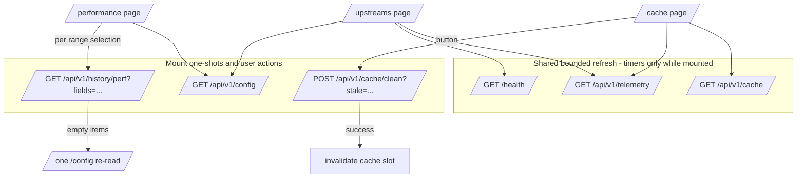

# P5-08 — Runtime Pages · Development Plan

---

## Goal Capsule

- **Objective:** an operator on the LAN reads cache health, per-stage engine latency against its budgets, and upstream endpoint health from three dashboard pages, with every rendered figure traceable to a documented API field and every budget drawn as a marker, never a wall.
- **Means:** three lazy Preact routes (`/cache`, `/performance`, `/upstreams`) on the p5-05/p5-06 architecture — shared bounded refresh, route-declared lifecycle, lazy uPlot (KTD1, KTD2).
- **Authority hierarchy:** task file `p5-08-runtime-pages.md` > the API (API.md, and where they disagree, the Rust) > the artboards (structure, placement, labels) > information-architecture.md / visual-system.md > existing implementation patterns. Artboard figures are drawings, never measurements (phase constraint 8).
- **Stop conditions:** a figure with no documented field or stated derivation in §6 → stop, record the conflict, do not invent. A needed Rust change → stop and surface (none is expected). A gate failure that survives three attempts → BLOCKED per plan/CLAUDE.md.
- **Tail ownership:** implementation ends at `docs/code-review/phase5/p5-08-runtime-pages-review.md` per phase CLAUDE.md §TASK COMPLETION. No commit, no push, no `.md` edit outside that review file without the owner's explicit yes.

---

## Product Contract

### Summary

Build Cache, Performance and Upstreams — the three runtime pages Pi-hole has no equivalent for — as lazy routes in the existing dashboard, reading `/cache`, `/telemetry`, `/health`, `/history/perf` and `/config`, with one mutation (`POST /cache/clean`), no WebSocket subscription, and no page-owned timer.

### Problem Frame

These pages are where FastAdHunter's own capabilities surface: cache lifetime stages and the two bounds, per-stage latency percentiles, endpoint health under the adaptive strategy. The data all exists on documented endpoints; what is missing is the UI, and the risk is a UI that derives what the API does not support or reads health zeros as good news. The task file is explicit about both failure modes.

### Requirements

Traceability: R1–R13 restate the task file's Scope and Acceptance criteria; nothing here is new scope.

**Provenance**

- R1. Every stage, bound and counter on all three pages traces to a documented field or to a §6 derivation row. Anything else is a conflict, not a frontend invention.
- R11. `allowed_delta` is labelled `allow` — the real allow verdict — never "permitted". The pass band is the documented derivation `queries_delta − blocked_delta − allowed_delta` (`crates/fah-model/src/perf.rs`).

**Cache**

- R2. The clean action's stale-purge toggle defaults off and is worded as giving up serve-stale insurance. The result panel reports removed counts, before/after, freed bytes, and states that RSS does not fall by the freed amount because a clean never shrinks the table slab.
- R12. SWR and background-cleanup panels render the `telemetry.counters` blocks. `cache_cleanup.last_duration_micros` is a last-value gauge: rendered as a current value, never as a series, never deltaed.
- R13. Both bounds side by side, entries and bytes, with the higher of `load_percent` / `byte_load_percent` marked as the one about to evict; the page states that `bytes` is a coarse per-entry estimate excluding hash-table slabs.

**Performance**

- R3. Latency is only ever shown per stage (block, cache hit, forward) and as percentiles (p50, p99). Never an average. The page states percentiles are bucket-granularity estimates that saturate at the top finite bucket.
- R5. `history.enabled = false` renders as its own full-page state, read from `/config`, distinct from an empty range.
- R6. No chart implies an enforced limit: budget lines are dashed targets; decimation is surfaced as on the Dashboard.

**Upstreams**

- R4. A degraded health status renders amber with an in-place explanation, per strategy; the strategy in force is read from `GET /config` (`dns.upstreams.strategy`) and named on the page. Under `fallback` the health block does not present its zeros as good news. `family: null` renders as unknown, never the word "null". Consecutive failures is distinguished as the live figure against the cumulative totals.

**Lifecycle**

- R8. None of the three routes declares an event type; the WebSocket is closed while one is active. Cache and Upstreams read through the shared bounded refresh only while mounted; Performance holds no timer and fetches once per range selection. Asserted with a request log.

**Presentation**

- R7. Correct in both themes at all three breakpoints, verified at 390 px.
- R10. Mobile: the Upstreams row becomes one card per endpoint with the counter grid at two columns; Cache bars stay full width; Performance legends sit below the plot and charts are readable without pinch-zoom.

**Gates**

- R9. Cargo and frontend gates green; bundle size recorded, gzip and brotli.

### Scope Boundaries

- Settings, Diagnostics, Health, Memory, Live Feed — p5-09. Memory figures live there, not here (task §Out of scope).
- No Rust change: no new route, no new config key, no wire change. `requests/` fixtures already cover `/cache` and `/cache/clean`.
- No shell retrofit: topbar, Lists header, Dashboard behaviour stay as shipped, except the one inherited p5-06 F5 fix (§10, U7).
- No sketch file edits; artboard deviations are recorded in §4b instead.

#### Deferred to Follow-Up Work

- p5-06 F12 (`/health` fetched twice at boot) — belongs to whoever revisits `shell.tsx`.
- IA §Performance's RSS and cache-series charts, if the owner wants them at all, are a post-p5-09 question (see C2).

---

## Planning Contract

### Sources and precedence

1. Artboards `docs/dashboard/sketch/{Cache,Performance,Upstreams}.dc.html` — structure, placement, labels. There are **no mobile artboards** for these pages; the task file's §Mobile paragraph and the p5-07 §9 conventions govern 390 px.
2. API.md §Cache, §Health & telemetry, §History, §Configuration — and where a doubt remained, the Rust (`crates/fah-api/src/{routes,wire}.rs`, `crates/fah-model/src/perf.rs`, `crates/fah-config/src/schema/dns/upstreams.rs`), all verified during planning.
3. Task file `p5-08-runtime-pages.md`.
4. information-architecture.md §Cache/§Performance/§Upstreams/§Cross-cutting, visual-system.md — where the artboards are silent.
5. PERFORMANCE.md §Budgets — the budget constants and their framing.
6. Existing patterns: p5-06 chart/refresh idioms, p5-07 page/header/mutation idioms.

**Inherited from p5-06/p5-07 reviews, binding here:**

| From | Obligation |
| ---- | ---------- |
| p5-06 F1 | a desktop row and its header are one grid; actions are 44×44 glyphs |
| p5-06 N1 | every control measured from the DOM at 390 px, not eyeballed |
| p5-06 F16 | `scrollWidth === clientWidth` checked at 1400/1200/900/390 px minimum, both themes |
| p5-06 F17/N4 | no `color-mix(… , transparent)` alpha washes that vanish in one theme; tints via tokens |
| p5-06 F5 (deferred to here) | the Dashboard phone Cache card drops the `free` band at <768 px — done beside U4 (§10) |
| p5-06 F11 | avoid a second concurrent `GET /config` when an empty range answer beats the mount read — the perf hook joins the in-flight read (§7.2) |
| p5-06 F9 | chart footnote wording interacts with `Chart`'s decimation footnote — do not duplicate it |
| p5-06 review ranges note | the chart deliberately keeps the previous range's data up during a fetch; axis reads resolution off the response, not the chips |
| housekeeping | `docs/code-review/phase2.6/p2.6-11-optin-deploy-soak-review.md` is modified on the 2.6 track — stage p5-08 paths explicitly, never `git add -A` |

---

### §3 Conflicts, resolved

| # | Conflict | Resolution |
| - | -------- | ---------- |
| C1 | `routes.ts` declares `/cache` with `endpoints: ['cache']`, but the task and IA require the SWR and cleanup counters from `/telemetry` "through the shared bounded refresh". | `/cache` declares `endpoints: ['cache', 'telemetry']`. `routes.test.ts` pin updated. `REFRESH_ENDPOINTS` itself is unchanged. |
| C2 | IA §Performance lists "RSS and peak RSS · cache entries and hit ratio" charts. The task file's Scope omits them, the artboard draws neither, and the task's Out-of-scope sends memory to Diagnostics (p5-09). | Build to task + artboard: latency, QPS, verdict deltas only. IA correction proposed in §13, not applied. |
| C3 | `Cache.dc.html` prints latency figures in prose ("answers … at `0.051 ms`", "the difference between `0.051 ms` and an upstream round trip"). The only same-page source would be `telemetry.latency` `sum/count` — the lifetime mean API.md warns is meaningless, and R3 forbids averages anywhere. | The numerals are dropped; the notes keep their meaning without a figure ("answers the client directly, without leaving the box"). Deviation X1. |
| C4 | The artboard's Clean card draws a `Cancel` button. There is nothing to cancel: the card is always visible, the checkbox is the choice, and the POST is a fast cache operation that is not aborted mid-flight. | Single action button with a pending (disabled) state; no dialog, no navigation block. Deviation X2 and §9. |
| C5 | The artboard fills the forward tile's budget bar amber at 41.2 %. No documented threshold exists between 0 and the budget; an amber tier would invent one. | The bar is the neutral accent while under budget and switches to the blocked/danger tone only at ≥ 100 % of budget — the one documented boundary. The page's own copy frames a crossing as "investigate", not failure (R6). Deviation X3. |
| C6 | The QPS card prints "20 k+ sustained capacity measured" — not an API figure. | Kept as a static, doc-sourced constant in the same class as the 1 ms budget line: both live in one constants module citing PERFORMANCE.md §Budgets, labelled as measured on the RB5009. KTD6. |
| C7 | Artboards draw topbar decorations (uptime `up 4h 31m`, a degraded dot) the shipped shell does not have. | Shell untouched, per p5-07 precedent (Lists was not retrofitted). Degraded surfaces in the Upstreams page banner; uptime belongs to Health (p5-09). Deviation X4. |
| C8 | `Upstreams.dc.html` draws two refresh clusters with contradictory ages — one in the degraded banner ("41 s / 1 m"), one on the Endpoints card ("2 m / 5 m"). | One cluster per polled endpoint (the refresh-cluster contract): `health` cluster in the page header, `telemetry` cluster on the Endpoints card title bar. The banner carries no controls. Deviation X5. |
| C9 | Under `fallback`, every row publishes `state: healthy`, `penalty_round: 0` and zeros for penalties, penalized seconds, probes and probe successes — which API.md states means *no health state exists to report*. The artboard draws the adaptive rendering only. | Under `fallback` the state pill and the four health cells (penalties, penalized for, probes, probe successes) are **omitted**, leaving attempts / failures / consecutive / TLS handshakes and the histogram; the states-legend card swaps its body for the fallback explanation; the subtitle names the strategy. Zeros are never rendered as health. KTD5. |
| C10 | `penalty_round` is "the last penalty applied, never cleared by recovery" — an endpoint healthy for an hour still publishes the round it reached. The artboard prints "round 2" beside the PENALIZED pill. | `round N` renders only while `state === 'penalized'`, exactly as the artboard places it. On healthy/probing rows it is not shown — printing it there would imply an active state the field does not carry. |
| C11 | `LatencySummary` reports `0.0` for a stage with **no queries in that interval** (`fah-model/src/perf.rs` doc). Plotting those zeros draws false latency dips; a tile would print `0.000 ms`. | Exact `0.0` maps to a gap (`null`) in every latency series, and a tile whose latest sample is `0.0` renders `—` with "no traffic in this stage in the latest sample". A real measured value cannot be exactly `0.0` (the estimate returns a bucket bound). KTD7. |
| C12 | The Performance subtitle hard-codes "one row per 60 s". `history.sample_interval_seconds` is a config key (boot-only). | The interval is read from the mount `/config` snapshot; `60` is the fallback when the key is absent. `Config` type gains the optional key. |
| C13 | The verdict chart's legend appends "(too few to see at this scale)" to `allow` — a data-dependent claim drawn as static copy. | Legend renders plain `allow`; a footnote states that `allow` is the explicit exception verdict and typically sits orders of magnitude below `pass` (capability-matrix vocabulary). Deviation X6. |
| C14 | `GET /config` can fail, and the Upstreams page cannot name the strategy without it. | Counters render verbatim, the state pill renders as published (adaptive-shaped data is the only kind that shows non-zero health fields anyway), and the subtitle says "strategy unknown — configuration unreachable"; the degraded banner, if shown, gives both strategy readings. No retry loop — the mount one-shot's failure is a stated degraded rendering, mirroring the Dashboard's "`/config` failing costs two secondary readings" stance. |

### §4b Deviation registry — the complete list

Everything a built page deliberately departs from its artboard. Anything not listed is artboard-verbatim.

| # | Artboard draws | Shipped instead | Decided |
| - | -------------- | --------------- | ------- |
| X1 | `Cache.dc.html` — `0.051 ms` figures inside the fresh-stage and hit-rate notes | the notes without numerals | C3 |
| X2 | `Cache.dc.html` — a `Cancel` button beside `Remove expired` | one action button with a pending state | C4 |
| X3 | `Performance.dc.html` — an amber budget bar at 41.2 % | neutral accent under budget; danger tone only at ≥ 100 % | C5 |
| X4 | all three — topbar uptime; `Upstreams.dc.html` — a topbar degraded dot | shell unchanged; degraded lives in the page banner | C7 |
| X5 | `Upstreams.dc.html` — a refresh cluster inside the degraded banner | header cluster (`health`) + Endpoints-card cluster (`telemetry`); banner uncontrolled | C8 |
| X6 | `Performance.dc.html` — "(too few to see at this scale)" in the verdict legend | plain `allow` legend + explanatory footnote | C13 |
| X7 | `Upstreams.dc.html` — "long runs dominate" annotation and amber/red histogram bars on the penalized row | neutral histogram bars at every state; the printed counts carry the figures, the card footer carries the reading guide | §8.3 |
| X8 | `Cache.dc.html` — a single header refresh cluster | header cluster for `cache` plus a second `telemetry` cluster on the SWR card title bar | C8's one-cluster-per-endpoint rule, §8.1 |
| X9 | `Performance.dc.html` — QPS stat labels "now, per second" / "busiest sample"; tiles implying a live reading | "latest sample" / "busiest served sample", tiles labelled "latest sample of the selected range" — at `stride > 1` the latest served row is not "now" | E10, E14 |

### Key Technical Decisions

- KTD1. **All three pages are lazy route chunks on the existing shell.** `built: true`, `load: () => import(...)`, `ownsHeader: true` (each artboard draws a page-specific `h1` + subtitle, exactly the p5-07 header seam). `events: []` on all three — the socket closes, the indicator reads "not needed here" (R8).
- KTD2. **uPlot is reached only through `charts/runtime.ts` and `components/chart.tsx`.** No new static import of `uplot` anywhere; the three new chunks must not reference it (the p5-06/p5-07 assertion is re-run). New line-chart options live in a pure module `charts/lines.ts`.
- KTD3. **One `/history/perf` request per range selection, `fields` trimmed to what the page draws:** `qps,queries_delta,blocked_delta,allowed_delta,latency`. Never `rss_bytes`, `peak_rss`, `memory`, `cache`, `upstreams`, `answers_delta`, `minor_page_faults` (C2, R1). `max_points` stays at the server default (1000), so `stride > 1` is real at 7 d/30 d and the decimation footnote genuinely fires.
- KTD4. **Performance reuses the Dashboard's range vocabulary.** `RANGE_KEYS`/`RANGES` are imported from `pages/dashboard/ranges.ts` (Vite hoists the shared module; no duplication per engineering principle 4); the perf query builder is its own small function because `/history/perf` takes no `resolution`.
- KTD5. **The strategy gates the health rendering** (C9). One pure function classifies the rendering mode from `dns.upstreams.strategy`: `adaptive` → full health block; `fallback` → suppressed health block + fallback legend; unknown → verbatim counters + "strategy unknown" subtitle (C14). Unit-tested in isolation.
- KTD6. **Budget and capacity constants are code constants citing PERFORMANCE.md §Budgets**, in one module (`pages/performance/budgets.ts`): the three 1 ms stage budgets and the "20 k+ QPS measured on the RB5009" caption. They are documentation-sourced markers, the same class as the dashed budget line, and the module comment says so (C6).
- KTD7. **Latency `0.0` is "no traffic", not a measurement** — mapped to series gaps and tile em-dashes (C11).
- KTD8. **The clean mutation is a plain request, not a recompile.** No confirm dialog, no busy modal, no navigation block: the checkbox is the choice (R2), the button disables while in flight, the request is not aborted on unmount, and success calls `registry.invalidate('cache')` so the page's figures move at once. The result panel is session state — it does not survive navigation, and the API has no clean history to re-read (§9).
- KTD9. **Derived display values extend `src/derive.ts`** with E-numbered rows (§6), keeping the one-module-one-table review property p5-06 established. Formatting-only additions (`formatMiB`, ms labels) go to `charts/format.ts`; they are formatting, not derivation.
- KTD10. **The disabled-recorder state reuses the Dashboard's proven shape:** mount `/config` snapshot, full-page `EmptyState` when `history.enabled === false`, and a single `/config` re-read to disambiguate an empty response — joining the mount read if it is still in flight (p5-06 F11).

### High-Level Technical Design

Data flow per route — every arrow is the complete API activity attributable to that page:

WebSocket: closed on all three routes (`events: []`); the indicator shows "not needed here". Hidden document: the registry suspend stops the Cache/Upstreams timers; Performance has nothing running to stop.

---

## §6 Every derived display value on all three pages

Phase 5 standing constraint 1. A derivation is a stated arithmetic, textual or unit function of documented fields. **This table is complete. Anything not on it is read from a field verbatim, and nothing else may be derived.** Continues p5-06's `R*` and p5-07's `T*` numbering as `E*`; arithmetic rows live in `src/derive.ts`, display-unit rows in `charts/format.ts`.

| # | Display | Formula | Fields | Where |
| - | ------- | ------- | ------ | ----- |
| E1 | `free` band | `max(0, capacity − entries)` — p5-06 R7, same rule | `GET /cache` | Cache stage bar, 4th segment |
| E2 | `1,108 of 50,000` | formatting of `entries`, `capacity` | same | Cache stage-bar card secondary |
| E3 | `lookups` | `hits + misses` (equals resolved queries, `pass + allow`, per API.md's identity) | same | Cache counters table |
| E4 | hit-rate donut | `hits / (hits + misses) × 100`; zero denominator draws the empty track, no division | same | Cache counters card |
| E5 | "**X is the bound closest to evicting**" | the higher of `load_percent` / `byte_load_percent` names its bound; equal → "both bounds are equally loaded"; the bars themselves render the two fields verbatim | same | Cache bounds card callout |
| E6 | `1.1 MiB / 64 MiB`, `2.7 MiB` freed, `9.4 MiB` | `formatMiB(bytes)` — display unit conversion only | `bytes`, `max_bytes`, `freed_bytes`, `bytes_freed` | Cache bounds card, result panel, cleanup panel |
| E7 | stale-purge preview "(N expired … would remove M stale)" | formatting of `expired`, `stale` from the live snapshot | `GET /cache` | Cache clean card |
| E8 | "Last clean, 03:14" | client receive-time of the response; session-local, lost on unmount (KTD8) | `POST /cache/clean` response | Cache result panel |
| E9 | `last run took 1.84 ms` | `last_duration_micros / 1000`, rendered as a current value only — never a series, never deltaed (R12) | `telemetry.counters.cache_cleanup` | Cache cleanup panel |
| E10 | latency tiles `0.039 ms` | latest **served** sample's `latency.<stage>_p99 × 1000`; exact `0.0` → `—` + "no traffic in this stage in the latest sample" (KTD7). Decimation drops rows, so at `stride > 1` the latest served sample lags real time by up to `stride × interval` — the tile label says "latest sample of the selected range", never "now" | `/history/perf latency` | Performance tiles |
| E11 | tile budget bar | `value_ms / 1.0`, capped at 100 % for display; tone flips only at ≥ 100 % (C5) | same + KTD6 constant | Performance tiles |
| E12 | latency series | `*_p50`/`*_p99 × 1000` per item; exact `0.0` → `null` gap (KTD7) | same | Performance latency chart |
| E13 | budget line `1.0 ms — budget` | KTD6 constant, dashed | PERFORMANCE.md §Budgets | Performance latency chart |
| E14 | QPS stat row | last served item's `qps` / `max(qps)` over the **served** items — at `stride > 1` a 1-in-stride subsample, so the labels read "latest sample" and "busiest served sample", not "now" / the range's peak | `/history/perf qps` | Performance QPS card |
| E15 | "20 k+ sustained capacity measured" | KTD6 constant, labelled measured on the RB5009 | PERFORMANCE.md §Budgets | Performance QPS card |
| E16 | `pass` band | `queries_delta − blocked_delta − allowed_delta`, floored at 0 — the derivation `fah-model/src/perf.rs` documents (R11) | `/history/perf` deltas | Performance verdict chart |
| E17 | decimation footnote | `stride` via `Chart`'s `decimatedBy` — p5-06's footnote, not a second wording (F9) | `/history/perf stride` | Performance charts |
| E18 | subtitle "one row per N s" | `history.sample_interval_seconds` from the mount `/config` snapshot; `60` when absent (C12) | `GET /config` | Performance header |
| E19 | x-axis / "7 d ago … now" labels | formatting of `items[].ts` | `/history/perf` | Performance charts |
| E20 | endpoint index badge `0, 1, 2` | array index — documented as the answering-endpoint identity, rows in configured order | `telemetry.upstreams[]` | Upstreams rows |
| E21 | `penalized for 312 s` | formatting of `penalized_seconds_total` with the unit; no duration arithmetic | same | Upstreams counter grid |
| E22 | failure-run histogram bars | `failure_runs[i]` normalized to the row's own max bucket; all-zero → empty tracks; counts printed verbatim beneath | same | Upstreams rows |
| E23 | `round N` | `penalty_round`, rendered only while `state === 'penalized'` (C10) | same | Upstreams state line |
| E24 | `dot · family unknown` | `family === null` → the word "unknown"; `v4`/`v6` verbatim. The explanation ("the host is a domain name resolved at connect time — nothing resolves it to fill the field in") renders as a sentence in the Endpoints-card footer whenever at least one row is unknown, so touch gets it; a `title` on the word is a desktop convenience only | same | Upstreams state line + card footer |
| E25 | degraded banner text | branch on `health.status` × strategy (KTD5): adaptive → "no endpoint is currently healthy"; fallback → "every endpoint carries a non-zero consecutive-failure count"; unknown strategy → both readings, attributed | `/health`, `/config` | Upstreams banner |

**Read verbatim, never derived:** `fresh`, `stale`, `expired`, `hits`, `misses`, `evictions`, `load_percent`, `byte_load_percent`, every `CacheCleanResponse` field except E6/E8's formatting, every `counters.swr` field, `runs`, `entries_removed`, `qps` per item, `queries_delta`, `blocked_delta`, `allowed_delta`, every `upstreams[]` counter, `state`, `protocol`, `address`, `stride`, `health.status`, `dns.upstreams.strategy`, `history.enabled`.

**Never derived at all on these pages:** any latency average (R3), any upstream share-of-traffic, success rate, availability percentage or health score, anything computed from `tls_handshakes`, any delta of two telemetry reads, any delta of `last_duration_micros` (R12), any per-query upstream attribution, any figure combining `/stats` with these endpoints, any schedule or clock arithmetic.

---

## §7 Route, lifecycle and API-client architecture

### 7.1 Route table changes (`src/router/routes.ts`)

| Route | events | endpoints | ownsHeader | One-shots and actions |
| ----- | ------ | --------- | ---------- | --------------------- |
| `/cache` | `[]` | `['cache', 'telemetry']` (C1) | yes | `POST /cache/clean` on the button; `invalidate('cache')` on success |
| `/performance` | `[]` | `[]` | yes | `GET /config` on mount; `GET /history/perf` per range selection; one `/config` re-read on an empty response (KTD10) |
| `/upstreams` | `[]` | `['telemetry', 'health']` (already declared) | yes | `GET /config` on mount — `strategy` is boot-only, so no re-read (the `api/config.ts` comment already states this split) |

`routes.test.ts` pins updated in the same change as each route flips `built: true`. `REFRESH_ENDPOINTS` stays exactly `['health','telemetry','cache','clients','lists']`.

### 7.2 The perf history hook (`pages/performance/`)

Mirrors the Dashboard's `useHistory` shape (KTD10) with two differences: the query is `from` + `fields` (KTD3, no `resolution`), and the disambiguation guard joins a still-in-flight mount `/config` read instead of issuing a concurrent second one (p5-06 F11). Behaviour retained from p5-06: loading holds across the disambiguation round trip so the wrong empty state never flashes; a range change keeps the previous range's series up while the new one loads; the plotted axis reads the response, not the chips.

Failure paths, stated rather than improvised (C14's stance extended to this page):

- A failed `/history/perf` renders through the shared `ErrorState`, as `queries-over-time.tsx` does; the range chips stay usable so a retry is a range re-selection.
- A failed mount `/config` is a degraded rendering, not an error state: the recorder is assumed enabled, charts render normally, and E18's subtitle falls back to 60 s.
- A failed disambiguation re-read settles loading into the per-card empty states — loading never holds past the failed round trip.

### 7.3 API client additions (`src/api/`)

- `history.ts`: `HISTORY_PERF_PATH`, a `HistoryPerfQuery { from, fields }` builder (comma-joined from a typed readonly array — an unknown name is a server `400` by design, so the names are a `const` list, not free strings), `getHistoryPerf`.
- `types.ts`: `PerfLatency` (six `number` fields), `PerfItem` (`ts` plus the optional keys this page requests — absent, not null, when trimmed by `fields`), `HistoryPerf` envelope (`from`, `to`, `stride`, `items`), `CacheCleanResponse` (six fields per `wire.rs`), and `Config` extended with `history.sample_interval_seconds?`.
- `cache.ts`: `cleanCache(stale: boolean)` — `POST` with `?stale=true` only when true, matching the documented default-off semantics.
- `index.ts` re-exports.

No new endpoint, no Rust change: `request_coverage.rs` is unaffected.

---

## §8 Page by page

### 8.1 Cache (`/cache`)

Build to `Cache.dc.html`. Header: `h1` "DNS cache", subtitle "Bounded by entries **and** bytes — `GET /api/v1/cache`", header-placement refresh cluster for `cache`. Cards, in artboard order:

1. **Entries by lifetime stage** — `StageBar` with fresh/stale/expired/free (E1) and the four-column legend carrying each stage's meaning verbatim from the artboard, minus the X1 numerals. Colours are the existing `--cache-*` tokens plus the free track.
2. **The two bounds** — two labelled progress bars from `load_percent` / `byte_load_percent` verbatim, MiB labels (E6), the E5 callout, and the coarse-estimate note (R13) — the artboard's wording, which already matches API.md.
3. **Lifetime counters** — lookups/hits/misses/evictions table (E3) and the hit-rate `Donut` (E4), "since process start" secondary.
4. **Clean now** — R2's checkbox (default off, artboard wording), the live preview (E7), one action button (X2, KTD8), and the result panel (E8, verbatim response fields, freed as MiB, the RSS note verbatim). Error path: the envelope's `message` via `ErrorState` inline in the card; the page's cards keep rendering.
5. **Stale-while-revalidate** — five `counters.swr` fields verbatim with the artboard's deduplicated/dropped note. The `telemetry` refresh cluster sits on this card's title bar (one cluster per endpoint; C8's rule applied to this page).
6. **Background cleanup** — runs / entries removed / bytes freed (E6) / last run took (E9, R12).

While `cache.data` is `null` (first read pending): the p5-06 `EmptyState("Not read yet")` per card, as `cache-state.tsx` does.

### 8.2 Performance (`/performance`)

Build to `Performance.dc.html`. Header: `h1` "Performance", subtitle "What the engine adds, per sample — `GET /api/v1/history/perf`, one row per N s" (E18). No refresh cluster — nothing on this page polls.

**Disabled recorder (R5, KTD10):** when the snapshot says `history.enabled === false`, the tiles and all three chart cards are replaced by one full-page `EmptyState` — the Dashboard's wording ("Nothing is written to `/data/history` while `history.enabled` is off. Turn it back on in Settings."). The "Reading this page" card stays. An empty range with recording on renders the normal per-card empty states — the two are distinguishable by construction.

1. **Three stage tiles** — block p99, cache-hit p99, forward "engine overhead p99" from the latest served sample (E10), each with the `BUDGET < 1 ms` chip and the proximity bar (E11, X3). The forward tile keeps the artboard's "engine overhead" wording — PERFORMANCE.md's stage definition, upstream RTT excluded. Tile and stat-row labels carry E10/E14's served-rows scoping: they describe the selected range's served samples, never a live "now".
2. **In-engine latency, p50 and p99 by stage** — six series: solid p99 / dashed p50 per stage, stage colours from `--series-2` (block), `--series-1` (cache hit), `--series-5` (forward); the dashed 1 ms budget line labelled "1.0 ms — budget" (E13, R6); range chips 24 h / 7 d / 30 d in the card title bar driving the page's single request (KTD3, KTD4); legend below the plot with "solid p99 · dashed p50"; the artboard's two footnotes verbatim (never-an-average; bucket-granularity saturation) plus `Chart`'s decimation footnote (E17).
3. **Queries per second** — area chart of `qps`, "per-interval, not cumulative" secondary, stat row: latest sample / busiest served sample (E14) / measured capacity (E15).
4. **Verdicts per interval** — pass (E16, `--series-4`), block (`--series-blocked`), allow (`--series-2`) areas; legend per C13/X6.
5. **Reading this page** — the artboard's three explainer columns verbatim: three stages never one number; decimation is visible; the budget is a target, not a limit (R6).

Range chips at 390 px use the `chips-mobile` pattern; legends already render below plots (R10 is the p5-06 idiom, kept).

### 8.3 Upstreams (`/upstreams`)

Build to `Upstreams.dc.html`. Header: `h1` "Upstream endpoints", subtitle "Health and state of each configured server — `/api/v1/telemetry` `upstreams`, strategy `<strategy>`" (KTD5, C14), header-placement `health` refresh cluster (X5).

1. **Degraded banner** — rendered only while `health.status === 'degraded'`: amber tokens, info glyph, E25's strategy-branched explanation ending "Clients are being served." Never an alarm tone (R4). No controls (X5).
2. **Endpoints card** — `telemetry` refresh cluster on the title bar; the configured-order note verbatim ("the index is what a query reports as its answering endpoint", E20). One `.ep` row per endpoint, three zones:
   - identity: index badge, mono `address`, state pill (adaptive only, C9) with `round N` when penalized (E23), `protocol · family` line (E24). Penalized rows keep the artboard's row tint, via a token that survives both themes (p5-06 F17).
   - counter grid, eight cells: attempts, failures, consecutive, TLS handshakes, penalties, penalized for (E21), probes, probe successes — the last four omitted under `fallback` (C9). Four columns desktop, two at <768 px (R10).
   - failure-run histogram: four bars (E22), caption `a · b · c · d  runs of length 1,2,3,4+`, neutral colour (X7).
   - card footer: the artboard's cumulative-versus-live note ("Consecutive failures is the live one…") and the histogram reading guide — R4's distinguishing statement; plus E24's family-unknown sentence when any row renders unknown.
3. **Why this is not a traffic pie** — artboard copy verbatim; the page charts health because that is what the data supports (task §Upstreams last bullet).
4. **What the states mean** — adaptive: the three pills with the artboard's explanations plus the fallback footnote; under `fallback` (KTD5) the card body is the fallback explanation instead: no health state exists to report, `degraded` there means every endpoint has a non-zero consecutive-failure streak, and a streak on a secondary can be hours old (API.md's reading, condensed).

At <768 px each `.ep` row becomes a stacked card (identity, then the two-column grid, then the histogram) — task §Mobile.

---

## §9 Mutation semantics — the one write

`POST /api/v1/cache/clean` (KTD8):

- Request: `?stale=true` only when the checkbox is on. Body none.
- No confirmation dialog and no busy modal: this is a cache maintenance call (`duration_ms` ~ single-digit), not a recompile — p5-07's R2 boundary does not apply. The checkbox wording is the deliberate-choice guard R2 requires.
- In flight: button disabled with a pending label; checkbox disabled; not aborted on unmount (the write must land; the lost result panel is stated in KTD8).
- Success: render the result panel (E8/E9 rows verbatim), reset nothing (the checkbox keeps its state — an operator repeating a purge should not re-arm it silently; it still defaults off on every mount, which is what R2 pins), and `refresh.invalidate('cache')` so the stage bar and bounds move now rather than at the next interval.
- A resolution that arrives after the page has unmounted **skips the invalidate**: `registry.invalidate` fetches unconditionally, so firing it then would issue a `/cache` read no active route owns (R8). The write still lands; the next mount revalidates through the shared refresh.
- Failure: the error envelope's `message` rendered in the card, `code`-selected presentation per the shared `ErrorState`; a `401` is `api/core.ts`'s business.

---

## §10 Phone and themes

No mobile artboards exist for these pages; the task's §Mobile paragraph is the specification, applied with p5-07 §9's conventions:

- Breakpoints stay 1200 / 768; verification at 1400, 1200, 900, 390 px (p5-06 F16).
- Cache: cards single-column; the stage bar and both bound bars stay full width; the stage legend grid drops 4 → 2 columns.
- Performance: tiles stack; chips via `chips-mobile`; legends below plots (already the idiom); chart heights unchanged — readable without pinch-zoom is verified, not assumed.
- Upstreams: one card per endpoint, counter grid 4 → 2 columns, histogram full width beneath.
- Every interactive control ≥ 44 px on both axes at 390 px, measured (p5-06 N1): chips, checkbox hit area, clean button, both refresh clusters' controls.
- Colours and tints exclusively via tokens; `literal-colours.test.ts` and `series-palette.test.ts` continue to pass; new tokens only if a needed tone is missing (expected: none — `--series-*`, `--cache-*` and the status tones cover §8's needs; the penalized row tint reuses the existing warn-tint token or adds one theme-paired token if none exists).
- **p5-06 F5 closure (inherited):** `pages/dashboard/cache-state.tsx` drops the `free` segment and its legend entry at <768 px, per `MobileDashboard.dc.html` — done in U7, beside this task's Cache work as the review directed.

---

## Implementation Units

### U1. API client: perf history, cache clean, config key

- **Goal:** every request and shape §7.3 names, typed and tested, before any page consumes them.
- **Requirements:** R1, R11 (types carry the documented semantics in comments), R2 (clean param).
- **Dependencies:** none.
- **Files:** `dashboard/frontend/src/api/history.ts` (extend — `historySummaryQuery` already lives here), `api/cache.ts` (extend — `getCache` already lives here), `api/types.ts`, `api/index.ts`, `api/resources.test.ts` (extend).
- **Approach:** follow `historySummaryQuery`'s builder pattern and `rules.ts`'s POST pattern; `fields` from a `const` readonly list (§7.3); doc comments carry the load-bearing API.md semantics the way existing types do (gauge warning, absent-not-null under `fields`, stride).
- **Test scenarios:**
  - perf query builder emits `from` and comma-joined `fields`, omits `to`, never emits an unknown field name.
  - `cleanCache(false)` posts with no query string; `cleanCache(true)` posts `?stale=true`.
  - `PerfItem` with trimmed fields typechecks as optional (a compile-time scenario: a consumer must handle absence).
- **Verification:** `npm run typecheck`, `npm run test` green; no new endpoint constant unused.

### U2. Derivations and formatting

- **Goal:** every §6 arithmetic row exists as a tested pure function before a page renders it.
- **Requirements:** R1, R3 (no average anywhere in the module), R11 (E16), R12 (E9 is a formatting, and no delta helper exists for it).
- **Dependencies:** U1 (types).
- **Files:** `src/derive.ts` + `derive.test.ts` (extend; header widened to the shipped pages), `src/charts/format.ts` (+ `formatMiB`, ms label helper).
- **Approach:** one exported function per E-row that is arithmetic (E1, E3, E4, E5, E10-selection, E11, E12-mapping, E14, E16, E22-normalization, E25-branch as KTD5's classifier); E-ids in comments. Zero-denominator and all-zero guards per the table.
- **Test scenarios:**
  - E4: zero lookups → 0, no NaN; E5: entries higher / bytes higher / equal → the three callouts.
  - E12/KTD7: `0.0` maps to `null`; a real value maps to ms.
  - E16: deltas floor at 0 when a restart-boundary row would go negative.
  - E22: `[0,0,0,0]` → all-zero heights; `[12,21,30,39]` → normalized to max.
  - KTD5 classifier: `adaptive` / `fallback` / `undefined` → the three modes.
  - `formatMiB`: bytes → one-decimal MiB, matching the artboard's `1.1 MiB`.
- **Verification:** `npm run test`; every §6 arithmetic row resolvable to one function.

### U3. Line-chart options module

- **Goal:** `charts/lines.ts` — pure uPlot options builders for multi-series lines with dashed variants, area fills, `null` gaps, a dashed horizontal budget line, and time x-axis, themed via `useChartTheme` tokens at build time.
- **Requirements:** R3 (per-stage series), R6 (budget as a dashed marker, drawn behind the series).
- **Dependencies:** none (parallel to U1/U2).
- **Files:** `src/charts/lines.ts`, `src/charts/lines.test.ts`.
- **Approach:** mirror `stacked-bars.ts`'s structure: options factory taking `(theme, series spec, unit formatter, budget?)`; budget via a draw hook (uPlot `hooks.draw`), never a fake data series; `spanGaps: false` so KTD7's `null`s render as gaps; options referentially stable per `(range, theme)` at the call site (p5-05 m4, the `chart.tsx` contract).
- **Test scenarios:**
  - series spec with `dash` produces a dashed stroke config; without, solid.
  - budget given → exactly one draw hook; omitted → none.
  - gap policy: options carry `spanGaps: false`.
  - axis formatter renders ms with the unit and qps without.
- **Verification:** `npm run test`; no `import 'uplot'` outside `charts/runtime.ts` (existing grep/test still green).

### U4. Cache page

- **Goal:** §8.1 complete, `/cache` route `built: true`.
- **Requirements:** R1, R2, R12, R13, R8 (declared endpoints only).
- **Dependencies:** U1, U2.
- **Files:** `src/pages/cache.tsx`, `src/pages/cache/{stage-card,bounds-card,counters-card,clean-card,swr-card,cleanup-card}.tsx`, `src/pages/cache.test.tsx`, `src/router/routes.ts` (+ `routes.test.ts` pin: endpoints `['cache','telemetry']`, C1), `src/styles/components.css`.
- **Approach:** `useRefresh` for both endpoints; `ContentHeader` with header cluster; cards per §8.1; clean flow per §9 (KTD8).
- **Test scenarios:**
  - stale toggle default off on mount; toggling changes only the request param (R2).
  - clean success renders the six response fields, the RSS note, and calls `invalidate('cache')` exactly once.
  - a clean resolving after unmount fires no `invalidate('cache')` — zero cache re-reads attributable to the left page (§9, R8).
  - clean failure renders the envelope message in the card; other cards untouched.
  - E9 renders `last_duration_micros` as one value; asserting the module renders no series/sparkline of it (R12).
  - `cache.data === null` → per-card "Not read yet"; no NaN anywhere at zero counters.
  - E5's three callout branches rendered.
- **Verification:** typecheck, tests, build green; route enterable in the dev gallery/dev server with mock or live API.

### U5. Performance page

- **Goal:** §8.2 complete, `/performance` route `built: true`.
- **Requirements:** R3, R5, R6, R8 (no endpoints, one-shot per range), R11.
- **Dependencies:** U1, U2, U3.
- **Files:** `src/pages/performance.tsx`, `src/pages/performance/{stage-tiles,latency-chart,qps-card,verdicts-card,reading-card,budgets.ts,use-perf-history.ts}.tsx|ts`, `src/pages/performance.test.tsx`, `src/router/routes.ts` + pins.
- **Approach:** hook per §7.2; charts via U3 options keyed on `(range, theme)`; tiles per E10/E11; KTD6 constants module; disabled-recorder full-page state per §8.2.
- **Test scenarios:**
  - exactly one perf request on mount and one per range change; none on re-render (request counter in the test fetch stub).
  - `history.enabled: false` → the full-page state; charts absent; "Reading this page" present (R5).
  - empty items with recording on → per-card empty states, after one disambiguating `/config` read; the mount-read join is exercised (empty answer while mount `/config` in flight → no second concurrent request, p5-06 F11).
  - a failed `/history/perf` renders `ErrorState`; a failed mount `/config` renders charts normally with the 60 s fallback subtitle; a failed disambiguation re-read exits loading into the per-card empty states (§7.2 failure paths).
  - `fields` sent is exactly KTD3's set.
  - tile with latest `0.0` → em-dash + no-traffic note (KTD7).
  - pass series floors at 0 (E16); allow labelled `allow` (R11).
  - stride > 1 in the stub → decimation footnote present (E17).
- **Verification:** typecheck, tests, build; chunk for this page carries no static `uplot` reference.

### U6. Upstreams page

- **Goal:** §8.3 complete, `/upstreams` route `built: true`.
- **Requirements:** R1, R4, R8.
- **Dependencies:** U1, U2.
- **Files:** `src/pages/upstreams.tsx`, `src/pages/upstreams/{degraded-banner,endpoint-row,states-card,no-pie-card}.tsx`, `src/pages/upstreams.test.tsx`, `src/router/routes.ts` + pins.
- **Approach:** `useRefresh` telemetry + health; mount `/config` one-shot; KTD5 classifier gates the row and legend rendering; rows per §8.3.
- **Test scenarios:**
  - adaptive + degraded → amber banner with the adaptive sentence; fallback + degraded → the fallback sentence; ok → no banner (E25, R4).
  - fallback rows: no state pill, four health cells absent, four counters + histogram present (C9); adaptive rows: all eight cells and the pill.
  - `family: null` → "family unknown", never the string "null"; the footer explanation sentence renders when any row is unknown and is absent when every family is known (E24).
  - `penalty_round: 3` on a healthy row → not rendered; on a penalized row → "round 3" (C10/E23).
  - `failure_runs` all zero → empty tracks (E22).
  - `/config` failure → "strategy unknown" subtitle, counters still rendered (C14).
  - strategy named in the subtitle in both normal modes (R4).
- **Verification:** typecheck, tests, build green.

### U7. Responsive, themes, and the inherited F5 fix

- **Goal:** §10 holds at all widths and both themes; p5-06 F5 closed.
- **Requirements:** R7, R10.
- **Dependencies:** U4, U5, U6.
- **Files:** `src/styles/components.css`, `src/styles/grid-tracks.test.ts` (extend for the new grids), `src/pages/dashboard/cache-state.tsx` (F5).
- **Approach:** media-query blocks per §10; tokens only; F5 as the review prescribed (conditional segment or a `<768px` selector — prefer passing the segment conditionally, the review's cleaner option).
- **Test scenarios:**
  - grid-tracks assertions for the new 4→2 column grids (counter grid, cache legend).
  - F5: at phone width the Dashboard cache card renders three segments and three legend entries.
- **Verification:** `npm run test`; visual pass deferred to U8's browser table.

### U8. Verification pass and review file

- **Goal:** the §Verification Contract table executed against a running container, evidence recorded, gates green, review file written.
- **Requirements:** R7, R8, R9 — the acceptance criteria that only a browser and a request log can prove.
- **Dependencies:** U1–U7.
- **Files:** `docs/code-review/phase5/p5-08-runtime-pages-review.md` (the one permitted .md, per phase CLAUDE.md §TASK COMPLETION).
- **Approach:** run the V-table below; record NOT RUN rows with reasons rather than inferring; bundle figures gzip and brotli per asset and total.
- **Test expectation: none** — this unit is evidence collection, not behavior.
- **Verification:** every V-row has a result or a stated NOT RUN; the review file's Implementation Summary is complete; the chat reply is the §TASK COMPLETION one-liner.

---

## Verification Contract

Frontend gates from `dashboard/frontend/`: `npm run typecheck`, `npm run test`, `npm run build` (the build enforces the 150 KB gzip budget and the postbuild assertions). Workspace gates: `cargo fmt --check`, `cargo clippy --workspace --all-targets -- -D warnings`, `cargo test --workspace` — no Rust source is expected to change, so cargo counts should match p5-07's. Then, against a running container, from a request log, the socket state and the DOM:

| # | Check |
| - | ----- |
| V1 | **Cache request discipline:** entering `/cache` issues zero one-shots; the only reads are the shared refresh's `/cache` and `/telemetry` on their intervals. `registry.activeTimers()` reads 2; leaving reads 0 and the in-flight requests abort (R8) |
| V2 | **Performance request discipline:** entering issues exactly `GET /config` + one `GET /history/perf` (with KTD3's `fields`); each range change issues exactly one more perf request; `activeTimers()` reads 0 throughout; parking on the page produces zero further requests over ≥ 5 minutes (R8) |
| V3 | **Upstreams request discipline:** entering issues exactly one `GET /config`; the shared refresh reads `/telemetry` and `/health`; `activeTimers()` reads 2 (R8) |
| V4 | **Socket closed on all three:** union `[]`, socket state closed, indicator "not needed here", no subscribe frame on entry — and server-side, no established connection from the parked browser, counted at the host serving the API (the p5-07 V2a method) |
| V5 | **Hidden page:** with each page hidden past the grace period, timers stop and the request log goes silent; becoming visible restarts timers and revalidates stale data; Performance issues nothing on visibility alone (R8) |
| V6 | **Clean action:** `POST /cache/clean` observed without `stale` by default and with `?stale=true` when toggled; the result panel matches the response byte-for-byte per field; `/cache` is re-read once via invalidate; RSS note present (R2) |
| V7 | **Disabled recorder, staged live:** `POST /api/v1/config {"history":{"enabled":false}}` (runtime-mutable, applies live) → Performance renders the full-page disabled state, distinct from the empty-range state; re-enable and both states verified (R5) |
| V8 | **Fallback strategy, staged:** dev container restarted with `[dns.upstreams] strategy = "fallback"` (boot-only): no state pills, no health cells, legend card swapped, subtitle names `fallback`, zeros nowhere presented as health (R4). If a restart cannot be staged in the run, the row is NOT RUN with the unit tests cited and the gap put to the owner |
| V9 | **Degraded, staged:** upstreams pointed at unroutable addresses in the dev config until `/health` reports `degraded` → amber banner with the strategy-correct sentence; not an alarm; page otherwise normal (R4). Same NOT RUN rule if unstageable |
| V10 | **Latency presentation:** only per-stage percentile series and tiles exist; no average anywhere on the page; budget line dashed; tile tone neutral under budget (R3, R6, X3) |
| V11 | **Decimation:** at 7 d and 30 d the response's `stride > 1` and the footnote renders; every plotted point is a served row (E17) |
| V12 | **Both themes at 1400 / 1200 / 900 / 390 px:** `scrollWidth === clientWidth` on the page body on all three pages at every width; §10's mobile shapes hold at 390 px; every control ≥ 44 px measured (R7, R10) |
| V13 | **Provenance audit:** every rendered figure on the three pages traced to a field or an E-row, recorded as a table in the review file; no derivation exists that §6 does not list (R1) |
| V14 | **Bundle:** gzip and brotli per asset and total against 153,600 B; three new lazy chunks; no chunk from this task references `uplot` statically (R9, KTD2) |
| V15 | **Bounded memory:** 5 navigation rounds across the three pages, heap flat (the p5-05 V11 method); the result-panel state does not accumulate |
| V16 | **Gates:** all six commands green; `routes.test.ts` pins reflect C1 and the three `built: true` flips |

---

## Definition of Done

- All acceptance criteria R1–R13 hold, each with V-table evidence or a stated NOT RUN the owner has seen.
- Every U-unit's verification passed; no unit skipped.
- No dead code from abandoned approaches; no `uplot` static import; no new dependency; no Pi-hole string; no comment in Rust (none is touched).
- The review file exists with its Implementation Summary; findings section awaits "start code review" per phase CLAUDE.md.
- Nothing committed, no phase table edit, no doc edit beyond the review file — all §13 proposals await the owner's yes.

---

## §13 Repository documents this task proposes to change — NOT applied by this plan

Listing is not permission (phase CLAUDE.md); each is proposed at the end of implementation and waits for the owner's explicit yes.

| Document | Proposed change | Reason |
| -------- | --------------- | ------ |
| docs/dashboard/information-architecture.md §Performance | drop or re-scope the "RSS and peak RSS · cache entries and hit ratio" chart list to match the task and artboard | C2 — the doc otherwise contradicts the shipped page |
| docs/code-review/phase5/p5-06-dashboard-and-lists-review.md | mark deferred F5 as closed by p5-08 U7 | the review said "worth doing beside p5-08's Cache page" |
| plan/wip/phase5/CLAUDE.md | status flip for task 8 on completion | workflow bookkeeping, owner-performed |

No API.md, CONFIGURATION.md, CONTEXT.md or SECURITY.md change: no endpoint, field, term or auth surface moves.

---

## Risks

- **Staging fallback and degraded states needs config restarts and induced failures** (V8, V9). Mitigation: unit tests cover the rendering branches completely; the live rows degrade to NOT RUN with the gap named, never inferred — the p5-07 V2a discipline.
- **First line/area charts in the codebase.** `stacked-bars.ts` proved the uPlot plumbing but not `dash`, `spanGaps`, fills or draw-hook overlays; jsdom cannot render canvas, so U3's browser behaviour is only provable in U8. Mitigation: the dev gallery gets specimens if drawing issues surface (the p5-06 route).
- **30 d perf request size.** 43,200 rows decimate server-side to ≤ 1000 items with `stride ≈ 44`; response stays bounded by `max_points` as built. No client mitigation needed; noted so nobody "fixes" it with `max_points: 5000`.
- **Restart boundary inside a plotted range** zeroes deltas for one sample (server computes per-interval against its own previous snapshot). Charts render the served zeros; no client-side smoothing (R1).
- **Bundle growth** estimated ≈ +8–12 KB gzip across three chunks against 66 KB of headroom (83,236 B at p5-07 close). The build gate decides, not the estimate.

---

## Deferred / Open Questions

### From 2026-08-27 review

- **The "family unknown" explanation (E24) is hover-only and inert on touch** — **RESOLVED 2026-08-27 (plan validation):** the explanation renders in the Endpoints-card footer whenever any row's `family` is null — the existing card-footer note pattern, no new dependency; the `title` stays as a desktop convenience. E24 and §8.3 carry the decision; U6 tests it.

---

## Appendix — research anchors

- Route/lifecycle contract: `dashboard/frontend/src/router/routes.ts`, `src/lifecycle/route-lifecycle.ts`, `src/refresh/registry.ts` (subscribe/invalidate/suspend semantics quoted in §7).
- Chart contract: `src/components/chart.tsx` (options identity, `setData`, `decimatedBy`), `src/charts/{runtime,theme,format}.ts`, `pages/dashboard/{queries-over-time.tsx,ranges.ts}` (range/axis/empty-state idioms).
- Cache clean wire shape: `crates/fah-api/src/wire.rs` `CacheCleanResponse`; params default in `wire.rs` test `clean_params_default_to_keeping_stale_entries`; fixture `requests/cache.http`.
- Perf sample semantics: `crates/fah-model/src/perf.rs` (pass derivation, `0.0` = no traffic, peak_rss monotonicity), `crates/fastadhunter/src/main.rs` delta computation, `crates/fah-api/src/routes.rs` `parse_perf_fields` (unknown field → 400).
- Strategy enum: `crates/fah-config/src/schema/dns/upstreams.rs` (`fallback` | `adaptive`).
- Tokens available: `--series-1..5`, `--series-permitted/blocked`, `--cache-fresh/stale/expired` (`src/styles/tokens.css`); series-palette and literal-colour tests pin usage.
